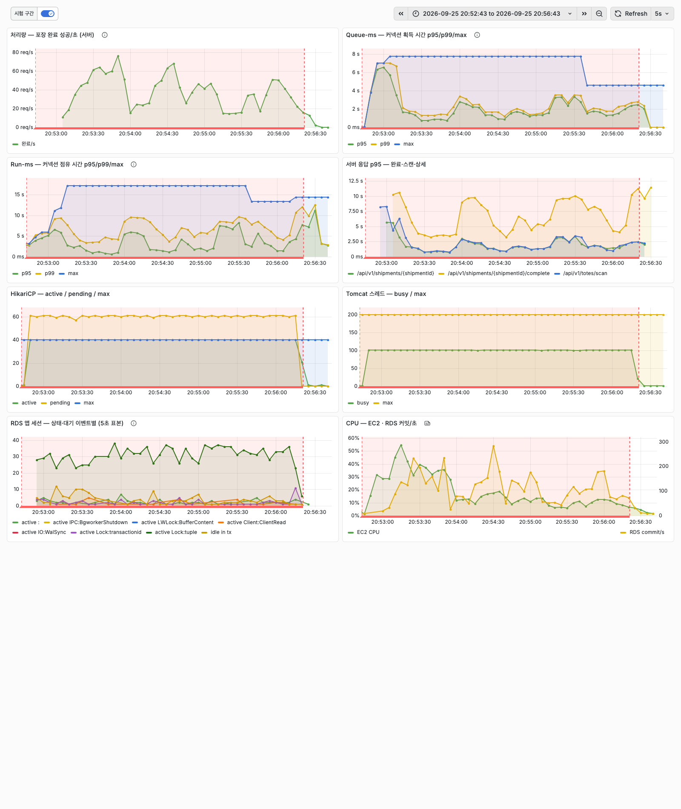
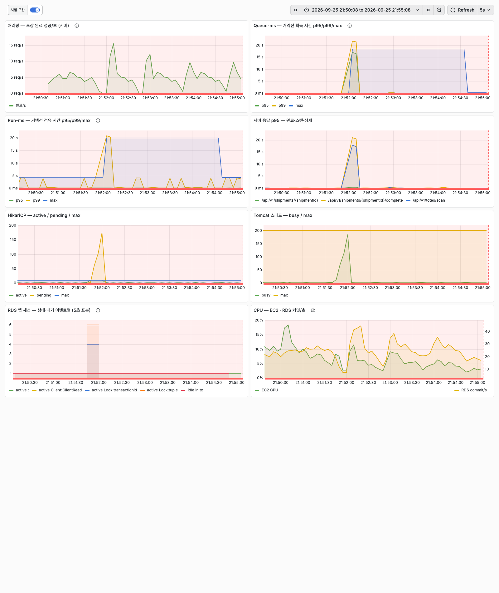

# 커넥션 풀 크기와 획득 타임아웃을 부하 실험으로 정하기

포장 완료에서 데드락이 나던 부하 테스트(작업자 50명)에서 HikariCP 커넥션 획득 대기가 최대 10.5초였다. 락과 무관한 배송단위 상세 조회도 서버 p95 가 5.5초였고, 그 시간은 전부 커넥션을 기다린 시간이었다. 락을 쥔 포장 완료 트랜잭션이 커넥션 10개를 모두 붙잡고 있었기 때문이다. 데드락은 재고를 원장 방식으로 바꿔 없앴지만, 커넥션 풀 설정은 그때도 지금도 기본값(`maximumPoolSize` 10, `connectionTimeout` 30초)이다. 이 글에서는 비즈니스 트래픽으로 필요한 커넥션 수를 산정하는 것부터, 부하를 고정하고 풀 크기와 타임아웃만 바꿔 잰 결과로 설정값을 정하고 다시 검증하기까지를 다룬다.

## 대상 시스템과 요청 경로

이 시스템은 풀필먼트 창고의 검수·포장 판단을 맡는다. 포장 작업자는 토트(피킹한 상품을 담아 오는 운반 용기)를 스캔하고, 화면에서 주문 내역과 추천 박스를 확인한 뒤 상자를 싸고 포장 완료를 누른다. 한 사이클에 Spring 서버로 요청 세 건이 간다.

| 요청 | 서버 부위 | 트랜잭션에서 하는 일 |
| --- | --- | --- |
| 토트 스캔 | `POST /api/v1/totes/scan` | 활성 토트 할당 조회, 배송단위 상태를 PACKING 으로 |
| 상세 조회 | `GET /api/v1/shipments/{id}` | 품목·예상 무게 조회 |
| 포장 완료 | `POST /api/v1/shipments/{id}/complete` | 재고 원장 기록, **박스 재고 행 `SELECT ... FOR UPDATE` 후 차감**, 토트 해제, 라인별 포장 건수 조회 |

Spring 서버는 EC2 c7i-flex.large(2 vCPU) 한 대, DB 는 RDS PostgreSQL db.t4g.micro(2 vCPU, 1GiB, `max_connections` 79)다. 요청마다 HikariCP 에서 커넥션을 하나 빌리고 트랜잭션이 끝나면 돌려준다(`open-in-view: false`).

## 비즈니스 트래픽과 필요 커넥션 산정

피크 시간대에 필요한 커넥션은 평균 1개가 안 된다. 수작업 포장 스테이션은 시간당 30~60건을 처리한다(OPSdesign, https://opsdesign.com/packing-stations-for-e-commerce/). 상한인 60건, 곧 작업자 1명이 1분에 1건을 포장한다고 두었다. 동시 작업자 수는 내부 문서에 없어 100명으로 가정했다. 같은 출처의 중견 브랜드 피크 사례(하루 8,000주문)를 8시간·시간당 60건으로 나누면 스테이션 약 17개이므로, 그 6배 규모의 센터다.

| 부하 | 작업자 | 요청/초 | 평균 동시 커넥션 | 3개 이상 겹칠 확률 |
| --- | ---: | ---: | ---: | ---: |
| 피크 1배 | 100 | 5.0 | 0.11 | 0.02% |
| 피크 3배 | 300 | 15.0 | 0.33 | 0.45% |

평균 동시 커넥션은 Little's law(동시 개수 = 도착률 × 머무는 시간)로 구했다. 요청 하나가 커넥션을 쥐는 시간은 사전 측정에서 평균 22.3ms 였다. 겹칠 확률은 도착을 포아송 분포로 본 값이다. 여기에 출고지시 배치 접수 1개(500주문 배치가 20~29초 동안 커넥션 하나를 쥔다)와 재고 집계 주기 작업 1개를 더하면, 피크 3배에서도 커넥션 6개면 된다는 계산이 나온다.

이 계산을 두 가지 예측으로 바꿔 실험에서 확인했다. 피크 부하에서는 풀 크기 2~40 사이에 처리량 차이가 없다(예측 A). 피크 3배에서 풀 5 이상이면 커넥션을 받으려고 줄 서지 않는다(예측 B).

## 실험 설계

부하는 고정하고 설정 하나만 바꿨다. 방식은 Oracle Real World Performance Group 의 커넥션 풀 영상(https://www.youtube.com/watch?v=_C77sBcAtSQ)을 따랐다. 영상은 스레드 9,600개와 생각 시간 550ms 를 고정하고 JDBC 풀 크기만 2048 → 1024 → 96 으로 줄이며, 처리량(TPS), 커넥션 대기 시간(Queue-ms), 실행 시간(Run-ms), DB 대기 이벤트를 같은 화면에 놓는다. 여기서는 k6 가상 사용자(VU)가 작업자, 사이클 길이(pacing)가 생각 시간이다.

| 부하 | VU | 사이클 | 설명 |
| --- | ---: | --- | --- |
| 피크 1배 | 100 | 60초(상자 싸는 시간 50초 포함) | 작업자 1명이 1분에 1건 |
| 피크 3배 | 300 | 60초 | 같은 작업자 300명 |
| 포화 | 100 | 0초 | 쉬지 않고 누름. 탐색에서 VU 50 에 이미 처리량이 멈춰(135.8건/s), 그 2배를 넣었다 |

조건마다 절차를 도구 하나(`tools/loadtest/pool-sweep.sh`)로 고정했다. 설정은 백엔드 컨테이너에 `SPRING_APPLICATION_JSON` 으로 넣어 다시 만들고, 실험용 배송단위 35,092건을 포장 전 상태로 되돌린 뒤 k6 를 돌린다. 워밍업(30초, 사이클이 있으면 60초)은 판독에서 뺀다. 한 조건이 끝나면 화면에 한 줄이 나온다.

```
pool  10 | VU  100 | pacing      0 | TPS   113.4 | Queue-ms p95   428.6 | Run-ms p95    68.9 | http p95   491.4 | pending max   91 | top wait IdleInTx:app(7.0)
pool  20 | VU  100 | pacing      0 | TPS   122.0 | Queue-ms p95   392.4 | Run-ms p95   204.5 | http p95   647.1 | pending max   81 | top wait IdleInTx:app(9.2)
pool  40 | VU  100 | pacing      0 | TPS    39.3 | Queue-ms p95  1614.0 | Run-ms p95  2001.3 | http p95  6323.0 | pending max   61 | top wait Lock:tuple(33.2)
```

Queue-ms 는 HikariCP 의 커넥션 획득 시간(`hikaricp_connections_acquire`), Run-ms 는 커넥션을 받아서 돌려줄 때까지의 점유 시간(`hikaricp_connections_usage`)이다. 두 타이머는 기본 설정에서 최댓값만 내보내므로, 히스토그램 버킷을 켜고 최소 버킷을 100µs 로 낮췄다. 획득 시간 대부분이 1ms 아래라 기본 최소 버킷(1ms)으로는 p95 가 버킷 경계값으로 뭉개진다. DB 대기 이벤트는 1초마다 `pg_stat_activity` 를 세어 모았다.

```yaml
management.metrics.distribution:
  percentiles-histogram:
    hikaricp.connections: true      # acquire·usage·creation
  minimum-expected-value:
    hikaricp.connections: 100us
```

판정 규칙은 실험 전에 문서로 남겼다(`docs/evidence/pool-sizing/PLAN.md`). 최고 처리량의 98% 를 내는 가장 작은 풀(규칙 1), 획득 대기가 사라지는 가장 작은 풀(규칙 2), DB 쪽 락·IO 대기 비중이 5%p 넘게 늘기 시작하는 풀(규칙 3)이다.

## 피크 부하의 풀 스윕 결과

피크 부하에서 처리량은 풀 크기와 무관했다. 예측 A 와 B 가 모두 맞았다.

| 부하 | 풀 | 완료/s | Queue-ms p95 | pending max | 서버 완료 p95 |
| --- | ---: | ---: | ---: | ---: | ---: |
| 피크 1배 | 2~40 | 1.7 | 1.7ms | 0 | 53.5~60.9ms |
| 피크 3배 | 2 | 5.0 | **15.4ms** | **1** | 61.7ms |
| 피크 3배 | 5~40 | 5.0 | 1.6ms | 0 | 49.7~52.2ms |

풀 2 만 피크 3배에서 줄을 섰다. 나머지 Queue-ms p95 1.6~1.7ms 는 줄 선 시간이 아니다. HikariCP 는 500ms 넘게 쉰 커넥션을 내주기 전에 DB 에 살아 있는지 물어본다(`HikariPool.getConnection` 의 `aliveBypassWindowMs`, 기본 500ms). 1분에 한 번 누르는 부하에서는 커넥션 대부분이 500ms 넘게 쉬므로 이 왕복이 획득 시간에 들어간다. 확인하지 않는 창을 600초로 늘리는 JVM 옵션(`-Dcom.zaxxer.hikari.aliveBypassWindowMs=600000`)으로 같은 부하를 다시 돌리자 p95 가 0.1ms 로 내려갔다. 그래서 규칙 2 의 "1ms 이하"는 "pending 0, 획득 p95 가 풀 40 과 같은 수준"으로 읽었다.

비즈니스 부하에서는 풀 크기가 5 이상이면 무엇이든 같다. 풀 크기가 차이를 만드는 것은 요청이 DB 가 처리할 수 있는 양보다 많이 들어올 때다.

## 포화 부하의 풀 스윕 결과

포화 부하에서 처리량은 풀 20 에서 가장 높았고, 30 부터 무너졌다. 각 풀을 두 번씩 돌렸고, 두 번째는 풀 40 부터 거꾸로 돌려 시간에 따른 변화를 상쇄했다.

| 풀 | 완료/s (1회, 2회) | Queue-ms p95 | Run-ms p95 | 서버 완료 p95 | DB 에서 일하는 세션 | 상위 대기 |
| ---: | --- | ---: | ---: | ---: | ---: | --- |
| 2 | 29.3, 25.4 | 1.8~2.4초 | 40~42ms | 1.8~2.4초 | 1.9 | 트랜잭션 중 앱 대기 1.5 |
| 5 | 71.0, 67.1 | 641~736ms | 46~47ms | 704~789ms | 4.7 | 트랜잭션 중 앱 대기 3.7 |
| 10 | 113.4, 106.7 | 429~467ms | 69~75ms | 491~542ms | 9.5 | 트랜잭션 중 앱 대기 7.0 |
| 20 | **122.0, 119.3** | 392~405ms | 205~209ms | 640~647ms | 19.6 | 트랜잭션 중 앱 대기 9.0, `Lock:tuple` 6.0 |
| 30 | 56.7 | 1.4초 | 784ms | 3.4초 | 38.3 | `Lock:tuple` 24.5 |
| 40 | 39.3, 45.2 | 1.4~1.6초 | 1.5~2.0초 | 5.2~6.3초 | 42 | `Lock:tuple` 32.6~33.2 |



*풀 40, 작업자 100명 연속 입력. HikariCP active 가 40 에 붙은 채 DB 세션 30~40개가 `Lock:tuple`(박스 행 락)을 기다리고, 포장 완료 처리량이 15~80건/s 사이에서 흔들린다. 완료 서버 p95 는 10초 안팎이다.*

풀 2~20 구간은 영상과 같은 방향이다. 풀을 키울수록 커넥션을 기다리는 시간(Queue-ms)은 줄고, 커넥션을 쥐고 있는 시간(Run-ms)은 늘었다. 기다리는 장소가 HikariCP 의 대기열에서 DB 로 옮겨 간다. 풀 20 까지는 옮겨 간 대기보다 늘어난 동시 처리가 커서 처리량이 올랐다.

풀 30·40 에서 처리량이 무너진 곳은 박스 재고 행이다. 포장 완료 트랜잭션은 박스 재고 행을 `SELECT ... FOR UPDATE` 로 잠그고 차감한다. 실험 묶음 첫 20,000건 중 77% 가 박스 두 종류(3호·4호)를 쓴다. 풀 40 에서는 DB 에서 일하는 세션 42개 중 평균 33개가 `Lock:tuple`, 곧 같은 행의 락 대기열에 있었다. 풀을 20 에서 40 으로 늘리자 처리량은 1/3 로 줄고 완료 p95 는 8~10배가 됐다. 대기열이 길어진 만큼 처리량이 평평해지지 않고 떨어진 이유는 이번 계측으로 가리지 못했다.

풀 40 은 짧은 탐색(판독 45초)에서 131.8건/s 로 멀쩡했고, 판독을 180초로 늘리자 무너졌다. 후보로 보는 것은 포장 완료 트랜잭션이 박스 행 락을 쥔 채 라인별 PACKED 건수를 세는 조회(`countByLineIdAndStatus`)다. 판독이 길어질수록 PACKED 가 늘어 이 조회가 길어지고, 락을 쥐는 시간도 길어진다. 라인당 PACKED 5,466건에서 이 조회는 2.7ms 였다. 판독 중 락 보유 시간을 초 단위로 재지 않아 확인하지 못했다.

## 대기 시간 구간 분해

풀 10 의 포화 부하에서 완료 요청 한 건의 서버 p95 491ms 는 대부분 커넥션을 받기 전에 쓰였다.

| 구간 | 값(풀 10, 1회차) | 출처 |
| --- | ---: | --- |
| 커넥션 획득 대기(Queue-ms) | p95 429ms, 평균 264ms | `hikaricp_connections_acquire` |
| 커넥션 점유(Run-ms) | p95 69ms, 평균 29ms | `hikaricp_connections_usage` |
| 서버 완료 응답 | p95 491ms | `http_server_requests` |
| DB 에서 일하는 세션 9.5개의 상태 | 트랜잭션 중 앱 대기 7.0, CPU 0.9, 락 0.9 | `pg_stat_activity` 1초 표본 |

점유 시간 안에서도 DB 가 실제로 일한 시간은 일부다. 일하는 세션 9.5개 중 7.0개가 `idle in transaction` 상태였다. 트랜잭션을 연 채 Spring 서버가 다음 SQL 을 보내기를 기다리는 상태다. 포장 완료 트랜잭션은 조회·원장 기록·락·차감·해제·건수 조회까지 SQL 을 여러 번 오가므로, Run-ms 대부분은 Spring 서버의 처리와 네트워크 왕복이다. 영상의 Run-ms 는 DB 안의 실행 시간에 가깝지만, 이 시스템의 Run-ms 는 앱 쪽 시간을 더 많이 담는다.

## connectionTimeout 과 락 주입

기본값 30초에서는 락과 무관한 스캔이 작업자 화면의 한도(10초)보다 오래 서버에 붙잡혔다. 시나리오는 다음과 같다.

- **사용자 행동**: 포장 작업자 300명이 1분에 1건씩 포장하던 중, 관리자 세션이 박스 재고 행 6개를 20초 동안 잠근다(psql 에서 `SELECT ... FOR UPDATE` 후 대기).
- **서버 부위**: 그사이 들어온 포장 완료가 박스 행 락을 기다리며 커넥션을 쥔다. 다음 작업자의 토트 스캔(`POST /api/v1/totes/scan`)은 HikariCP `getConnection` 에서 빈 커넥션을 기다린다.
- **무엇 때문에**: 커넥션 10개를 락 대기 중인 완료 요청이 모두 쥐고, 획득 대기 상한이 30초다.
- **사용자가 보는 결과**: 스캔 화면이 10초 동안 응답 없이 멈췄다가 실패한다.

| connectionTimeout | 회 | 락 구간 스캔 p50 / p95 | 스캔 결과 | 클라이언트 타임아웃 | 서버 500 | Tomcat busy max |
| ---: | ---: | --- | --- | ---: | ---: | ---: |
| 30,000ms | 2 | 6.1~6.7초 / 10.0초 | 10초에 화면이 포기 | 95, 95 | 0 | 184, **200** |
| 3,000ms | 1 | 3.0초 / 3.0초 | 3초에 500 | 9 | 243 | 76 |
| 1,000ms | 2 | 1.0초 / 1.0초 | 1초에 500 | 10, 10 | 518, 530 | 62, 65 |



*connectionTimeout 30초. 21:52 부터 20초 동안 박스 행을 잠그자 HikariCP pending 이 174, Tomcat busy 가 184 까지 오르고, 획득 시간 max 가 18초를 찍는다. 스캔은 락과 무관하지만 커넥션을 받지 못해 같이 멈췄다.*

30초에서는 작업자 화면이 10초에 포기한 스캔을 서버가 최대 18초 뒤 200 으로 끝냈다. 두 번째 실행에서는 Tomcat busy 스레드가 설정 최대 200 에 닿았다. 3초와 1초에서는 서버가 화면보다 먼저 500 을 돌려줬고, 락 구간 밖에서는 획득 타임아웃이 한 건도 없었다.

어느 값에서도 이미 박스 행 락을 기다리던 포장 완료는 락이 풀릴 때까지(최대 20초) 커넥션을 쥐었다. 이 대기는 DB 락 대기라 connectionTimeout 으로 줄지 않는다. 락 대기 자체를 끊으려면 트랜잭션의 `lock_timeout` 이 필요하고, 이번 실험 범위 밖이다.

## 결정 규칙과 설정값

`maximumPoolSize` 는 10, `connectionTimeout` 은 3초로 정했다.

| 항목 | 기본값 | 결정값 | 근거 |
| --- | ---: | ---: | --- |
| `maximumPoolSize` | 10 | 10 | 포화 부하에서 규칙 1 은 20, 규칙 3 은 10 을 가리켰다 |
| `connectionTimeout` | 30,000ms | 3,000ms | 락 구간에서 서버가 화면(10초)보다 먼저 실패를 돌려준다. 사전 규칙이 가리킨 1초는 과부하에서 기다리면 성공할 요청까지 실패로 끝냈다 |

풀 크기에서는 사전 규칙끼리 충돌했다. 처리량 규칙은 20 을, DB 대기 규칙은 10 을 가리켰는데, 같은 부하 안에서 둘이 충돌할 때의 우선순위를 미리 정하지 않았다. 결과를 본 뒤 보완 규칙을 정했고 그 사실을 계획 문서의 변경 기록에 남겼다. DB 대기 규칙이 가리킨 10 을 상한으로, 피크 3배에서 줄 서지 않는 5 를 하한으로 두고 그 사이에서 포화 처리량이 가장 높은 풀을 골랐다. 20 은 처리량이 7~12% 높았지만, 처리량이 무너진 30 과 한 단계 차이다. 풀 크기는 기본값과 같지만, 이제는 10 을 넘기면 박스 행 락 대기가 늘고 30 에서 처리량이 무너진다는 측정값이 있다.

HikariCP 위키의 공식 `connections = (core_count × 2) + effective_spindle_count`(https://github.com/brettwooldridge/HikariCP/wiki/About-Pool-Sizing)에 RDS 의 2 vCPU 를 넣으면 5 안팎이다. 실측 최적(10~20)이 이보다 컸던 것은 Run-ms 대부분이 DB 밖(트랜잭션 중 앱 대기)에서 쓰였기 때문으로 본다. 커넥션 하나가 DB CPU 를 쓰지 않고 쥐어진 시간이 길수록 같은 코어 수에 더 많은 커넥션이 필요하다.

## 재검증

원장 크기를 조건마다 되돌린 재검증에서 결정값(풀 10, 3초)은 과부하 실패 없이 기본값과 같은 처리량을 냈다. 순서에 따른 영향을 상쇄하려고 결정 → 기본 → 기본 → 결정(ABBA) 순서로 포화 부하를 돌렸고, 조건마다 실험 원장을 지워 원장을 실험 전 20,317행으로 되돌렸다.

| 시작 | 설정 | 완료/s | 서버 완료 p95 | 실패율 | 획득 타임아웃 | 획득 max |
| --- | --- | ---: | ---: | ---: | ---: | ---: |
| 00:13 | 결정(10 / 3초) | 120.4 | 463ms | 0 | 0 | 2.83초 |
| 00:22 | 기본(10 / 30초) | 125.4 | 441ms | 0 | 0 | 2.71초 |
| 00:29 | 기본(10 / 30초) | 122.7 | 448ms | 0 | 0 | 2.02초 |
| 00:37 | 결정(10 / 3초) | 124.9 | 443ms | 0 | 0 | 3.00초 |

평균 처리량은 결정값 122.7건/s, 기본값 124.1건/s 로 1% 차이다. 3초는 락이 걸렸을 때 작업자 화면(10초)보다 먼저 실패를 돌려주면서, 락이 없는 과부하에서는 요청을 실패로 끝내지 않았다.

마지막 조건의 획득 max 2.996초는 3초 한도와 4ms 차이였다. 그 순간 전후 70초 동안 DB 에서 락을 기다린 세션은 평균 0.5개였고, 일하는 세션 대부분(8.1개)은 트랜잭션 중 앱 대기였다. 박스 행 락이 아니라, 작업자 100명이 커넥션 10개를 두고 선 대기열(pending 91)의 꼬리에서 나온 값이다. 이 부하에서 3초의 여유는 수 ms 이고, 작업자가 더 몰리면 3초에서도 획득 타임아웃이 난다.

3초는 두 번째로 고른 값이다. 사전 규칙이 가리킨 1초 후보를 먼저 같은 방식으로 재검증했더니, 과부하에서 커넥션 획득이 1초를 넘는 요청이 500 으로 끝났다(요청의 0.03%, 2.76%). 같은 시점의 기본값은 이 요청들을 최대 2.6초 기다려 처리했다. 그래서 2.6초보다 긴 3초를 골랐다. 1초 후보 재검증은 아래에서 설명할 표류가 있던 시점의 결과다.

## 실험 중 처리량 표류와 통제

같은 설정의 포화 처리량이 4시간 동안 절반 가까이 떨어졌다. 원인은 실험이 쌓은 재고 원장이었다. 조건마다 배송단위는 포장 전으로 되돌렸지만 원장 행은 지우지 않아, 포장 완료가 남긴 원장이 조건마다 약 6만 행씩 늘었다.

| 시작 | 원장 원복 | 조건 | 완료/s | RDS CPU | 크레딧 잔고 |
| --- | --- | --- | ---: | ---: | ---: |
| 20:40 | 없음 | 기본(10 / 30초) | 113.4 | 66.5% | 225.1 |
| 22:32 | 없음 | 기본(10 / 30초) | 103.5 | 72.9% | 129.9 |
| 23:46 | 없음 | 기본(10 / 30초) | 77.4 | 72.7% | 74.0 |
| 23:53 | 없음 | 기본(10 / 30초) | 66.4 | 73.5% | 68.0 |
| 00:22 | 있음 | 기본(10 / 30초) | 125.4 | 58.0% | 43.6 |
| 00:29 | 있음 | 기본(10 / 30초) | 122.7 | 41.0% | 39.7 |

후보는 두 가지였다. 원장 크기(47만 → 105만 행)와 RDS db.t4g.micro 의 CPU 크레딧(225 → 68)이다. 크레딧이 원인이면 원장을 되돌려도 하락이 남아야 한다고 먼저 적어 두고, 조건마다 원장을 되돌리는 절차를 도구에 넣었다. 실험 전용 DB 에서만 하는 절차이고, 운영 원장은 지우지 않는다. 원장을 되돌리자 크레딧은 계속 줄었는데도 처리량이 120건/s 대로 돌아왔다. db.t4g 는 Unlimited 모드로 동작하고(https://docs.aws.amazon.com/AmazonRDS/latest/UserGuide/Concepts.DBInstanceClass.Types.html), 처리량이 떨어지는 동안에도 RDS CPU 가 70% 안팎에 머물러 기준선으로 묶이지 않았다. 떨어지던 동안 포장 완료 1건이 읽은 DB 버퍼는 약 6.2천 블록에서 11.8천 블록으로 늘었고 캐시 적중률은 100% 였다. 원장 크기에 비례해 느려지는 쿼리 자체는 `pg_stat_statements` 가 꺼져 있어 특정하지 못했다.

앞의 포화 부하 풀 스윕은 원장을 되돌리기 전의 결과다. 두 번째 반복을 풀 40 부터 거꾸로 돌려 순위(20 이 최고, 30·40 에서 붕괴)는 두 번 모두 같았지만, 절댓값에는 표류가 섞여 있다.

## 남은 과제

- 박스 재고 행 락이 포화 처리량의 상한이다. 락을 쥔 채 세는 라인별 PACKED 건수 조회를 트랜잭션 밖으로 빼면 락 보유 시간이 줄 것으로 예상하고, 원장을 되돌리는 절차를 넣은 도구로 풀 10·20·30·40 을 다시 잰다.
- 포화 부하 풀 스윕을 원장 원복 절차로 다시 돌려 절댓값의 표류를 걷어 낸다.
- 락 대기로 쥔 커넥션은 connectionTimeout 이 풀지 못한다. 포장 완료 트랜잭션의 `lock_timeout` 을 실험한다.
- 원장 크기에 비례해 느려지는 쿼리를 `pg_stat_statements` 로 찾는다. 운영에서는 원장이 계속 자라므로 같은 하락이 시간에 걸쳐 나타난다.
- 3초 한도는 작업자 100명 연속 입력에서 여유가 수 ms 였다. 실제 동시 작업자 수로 1절 산정을 다시 하고, 그 수의 2배 부하에서 획득 max 를 잰다.
- Tomcat 스레드 수(200·50·20)에 따라 대기 위치가 Tomcat 과 HikariCP 사이에서 어떻게 옮겨 가는지는 재지 않았다.
