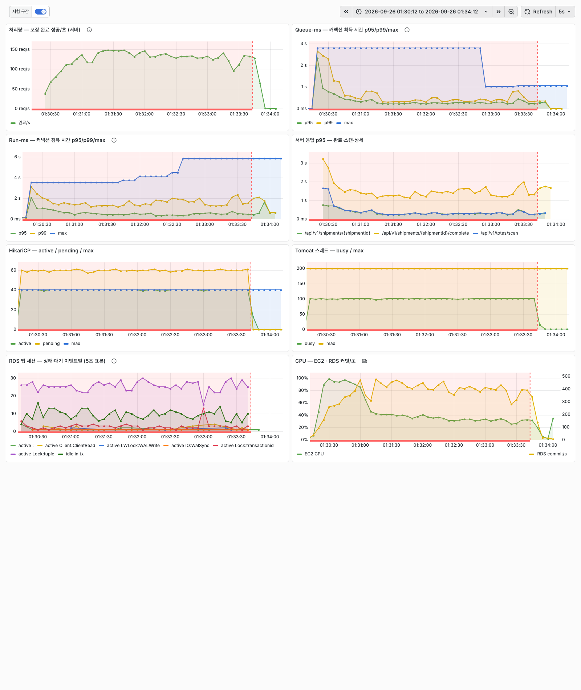

# 커넥션 풀 크기와 획득 타임아웃을 부하 실험으로 정하기

포장 작업자는 토트(피킹한 상품을 담아 오는 운반 용기)를 스캔하고, 화면에서 주문 내역을 연 뒤 상자를 싸고 포장 완료를 누른다. 2026-09-22 부하 테스트에서 작업자 50명이 이 동작을 반복하자, 락과 무관한 요청까지 같이 멈췄다. 토트 스캔과 주문 내역 조회(배송단위 상세 조회)는 DB 락을 잡지 않는다. 배송단위는 한 상자로 포장해 내보내는 단위다. 그런데도 상세 조회의 서버 p95(95번째 백분위)가 5.5초였다. 같은 요청이 작업자 10명 실행에서는 p95 0.04초였으므로, 늘어난 시간은 대부분 HikariCP(Spring Boot 기본 커넥션 풀)에서 커넥션을 기다린 시간으로 추정한다. 당시에는 획득 시간 히스토그램을 켜지 않아 직접 재지는 못했다.

원인은 포장 완료 트랜잭션이었다. 데드락에 걸린 포장 완료들이 커넥션 10개를 모두 쥔 채 락을 기다렸다. 커넥션을 받지 못한 요청이 줄 서는 pending(대기열)은 39까지 쌓였다. 커넥션 획득 시간은 최대 10.5초, 점유 시간은 최대 14.1초였다.

작업자 화면으로 보면 피해는 실패에 그치지 않았다. 포장 완료의 40.4% 가 실패했고, 성공한 스캔·상세 조회도 p95 가 5초를 넘었다. 작업자 50명의 완료 처리량은 2.9건/s 였다. 같은 부하에서 데드락을 없앤 뒤에는 32.6건/s 가 나왔다. 이 상태의 창고는 정상 처리량의 9% 로 돌아간 셈이다. 화면이 멈춘 작업자는 다시 누르고, 다시 누른 요청은 대기열을 더 늘린다.

데드락은 재고를 재고 원장(재고 변동을 행으로 쌓는 `inventory_tx` 테이블) 방식으로 바꿔 없앴다. 그러나 커넥션 풀 설정은 그때도 지금도 Spring Boot 기본값이다(`maximumPoolSize` 10, `connectionTimeout` 30초, Tomcat 스레드 200). 풀 10 이 이 창고 규모에 맞는지 잰 적이 없다. 작업자 화면은 클라이언트 타임아웃(k6 요청 타임아웃, 작업자 화면이 포기하는 시점) 10초에 요청을 포기한다. 30초 상한은 그렇게 포기한 요청을 서버가 최대 20초 더 붙잡게 둔다. 이 글의 락 주입 실험에서 기본값으로 박스 재고 행을 20초 잠갔다. 락과 무관한 스캔의 절반이 6~7초 뒤에야 응답했고, 일부는 클라이언트 타임아웃 10초에 걸려 실패했다. 락이나 느린 쿼리로 커넥션이 다시 묶이면 같은 방식으로 화면이 멈춘다. 기본값을 바꾸는 데는 설정 두 줄이면 된다. 어느 값으로 바꿀지는 이 창고의 트래픽과 실측으로만 정할 수 있다.

이 글에서는 비즈니스 트래픽으로 필요한 커넥션 수를 산정하는 것부터 다룬다. 이어서 스윕(부하를 고정하고 풀 크기만 바꿔 가며 잰 측정)과 요청 한 건의 대기 시간 분해를 적는다. 락이 걸렸을 때 획득 타임아웃이 작업자 화면에 미치는 영향도 쟀다. 마지막으로 설정값 결정과 재검증, 실험 도중 처리량이 떨어진 원인과 그 통제 방법, 남은 과제까지를 다룬다.

값을 정하려면 먼저 요청 하나가 커넥션을 어떻게 쓰는지 알아야 한다.

## 대상 시스템과 요청 경로

포장 한 사이클에 Spring 서버로 요청 세 건이 간다.

| 요청 | 서버 부위 | 트랜잭션에서 하는 일 |
| --- | --- | --- |
| 토트 스캔 | `POST /api/v1/totes/scan` | 활성 토트 할당 조회, 배송단위 상태를 `PACKING` 으로 |
| 상세 조회 | `GET /api/v1/shipments/{id}` | 품목·예상 무게 조회 |
| 포장 완료 | `POST /api/v1/shipments/{id}/complete` | 재고 원장 기록, **박스 재고 행 `SELECT ... FOR UPDATE` 후 차감**, 토트 해제, 라인별 포장 건수 조회 |

Spring 서버는 EC2 c7i-flex.large(2 vCPU) 한 대, DB 는 RDS PostgreSQL db.t4g.micro(2 vCPU, 1GiB, `max_connections` 79)다. 요청마다 HikariCP 에서 커넥션을 하나 빌리고 트랜잭션이 끝나면 돌려준다(`open-in-view: false`).

요청 경로를 알면 도착률과 점유 시간으로 필요한 커넥션 수를 계산할 수 있다. 실험 전에 계산부터 했고, 계산이 맞는지는 실험으로 확인했다.

## 비즈니스 트래픽과 필요 커넥션 산정

피크 시간대에 필요한 커넥션은 평균 1개가 안 된다. 수작업 포장 스테이션은 시간당 30~60건을 처리한다(OPSdesign, https://opsdesign.com/packing-stations-for-e-commerce/). 상한인 60건, 곧 작업자 1명이 1분에 1건을 포장한다고 두었다. 동시 작업자 수는 내부 문서에 없어 100명으로 가정했다.

| 부하 | 작업자 | 요청/초 | 평균 동시 커넥션 | 3개 이상 겹칠 확률 |
| --- | ---: | ---: | ---: | ---: |
| 피크 1배 | 100 | 5.0 | 0.11 | 0.02% |
| 피크 3배 | 300 | 15.0 | 0.33 | 0.49% |

평균 동시 커넥션은 Little's law(동시 개수 = 도착률 × 머무는 시간)로 구했다. 요청 하나의 커넥션 점유 시간은 사전 측정(작업자 20명이 쉬지 않고 누름, 풀 10)에서 평균 22.3ms 였다. 피크 3배 실측은 평균 27.0ms 였다. 겹칠 확률은 도착을 포아송 분포로 본 값이다.

여기에 출고지시 배치 접수 1개와 재고 집계기 `StockBalanceCollector`(5초 `fixedDelay` 스케줄러) 1개를 더했다. 배치 접수는 500주문 배치 하나에 19~29초 동안 커넥션 하나를 쥔다. 포장 요청이 4개 이상 겹칠 확률은 피크 3배에서도 0.04% 다. 그래서 커넥션 1 + 1 + 4 = 6개면 된다고 산정했다.

이 산정을 두 가지 예측으로 바꿔 실험 전에 적어 두었다. 예측 A 는 피크 부하(1배·3배)에서 풀 크기 2~40 사이에 처리량 차이가 없다는 것이다. 예측 B 는 피크 부하에서 풀 5 이상이면 커넥션 획득 시간 p95 가 1ms 아래라는 것이다.

산정대로라면 피크 부하에서는 풀 크기가 5 이상이면 무엇이든 같다. 풀 크기가 갈리는 것은 요청이 DB 가 처리할 수 있는 양보다 많이 들어올 때다. 그래서 포화 부하(작업자가 쉬지 않고 누르는 부하)를 따로 쟀다. 포화 부하에는 예측을 적지 않고 판정 규칙만 적었다. 계산은 평균값이라, 피크와 포화에서 실제로 어떻게 되는지는 부하를 고정하고 풀만 바꿔 쟀다.

## 실험 설계

부하는 고정하고 설정 하나만 바꿨다. 방식은 Oracle Real World Performance Group 의 커넥션 풀 영상(https://www.youtube.com/watch?v=_C77sBcAtSQ)을 따랐다. 영상은 스레드 9,600개와 생각 시간 550ms 를 고정하고 JDBC 풀 크기만 2048, 1024, 96 순으로 줄인다. 그러면서 처리량(TPS), 커넥션 획득 시간(Queue-ms), 커넥션 점유 시간(Run-ms), DB 대기 이벤트를 같은 화면에 놓는다. HikariCP 위키는 이 영상에서 풀 크기만 줄였을 때 응답 시간이 약 100ms 에서 약 2ms 로 줄었다고 요약한다(https://github.com/brettwooldridge/HikariCP/wiki/About-Pool-Sizing). 여기서는 부하 테스트 도구 k6 의 가상 사용자(VU)가 작업자 역할을 한다. 사이클 길이(pacing, 요청 세 건과 상자 싸는 시간 50초를 합한 한 주기)가 영상의 생각 시간 역할을 한다.

| 부하 | VU | 사이클 | 설명 |
| --- | ---: | --- | --- |
| 피크 1배 | 100 | 60초(상자 싸는 시간 50초 포함) | 작업자 1명이 1분에 1건 |
| 피크 3배 | 300 | 60초 | 같은 작업자 300명 |
| 포화 | 100 | 0초 | 쉬지 않고 누름. 탐색에서 VU 50 에 이미 처리량이 멈춰(135.8건/s), 그 2배를 넣었다 |
| 락 주입 | 300 | 60초 | 피크 3배로 돌리다 측정 구간(워밍업 뒤 집계하는 구간) 60초 뒤 관리자 세션이 박스 재고 행 6개를 20초 잠근다. 클라이언트 타임아웃은 10초 |

풀 크기는 피크 부하에서 2·5·10·20·40, 포화 부하에서 5·10·20·30·40 으로 바꿨다. 락 주입에서는 풀을 10 으로 두고 `connectionTimeout` 만 30,000·3,000·1,000ms 로 바꿨다.

조건마다 절차를 실험 도구 하나로 고정했다[^paths]. 설정은 Spring 서버 컨테이너에 `SPRING_APPLICATION_JSON` 으로 넣어 다시 만든다. 실험용 배송단위 35,092건을 포장 전 상태로 되돌린 뒤 k6 를 돌린다. 워밍업(30초, 사이클이 있으면 60초)은 측정 구간에서 뺀다. 한 조건이 끝나면 도구가 한 줄을 출력한다.

```
pool  10 | VU  100 | pacing      0 | TPS   125.2 | Queue-ms p95   373.8 | Run-ms p95    63.1 | http p95   445.1 | pending max   91 | top wait IdleInTx:app(7.0)
```

TPS 는 포장 완료 건/s 다. 커넥션 획득 시간은 `hikaricp_connections_acquire`, 커넥션 점유 시간은 `hikaricp_connections_usage` 로 쟀다. 획득 시간에는 줄 서서 기다린 시간 말고도 커넥션을 내주기 전의 생존 확인 왕복이 들어간다. 두 타이머는 기본 설정에서 count·sum·max 만 내보내 백분위를 볼 수 없다. 그래서 히스토그램 버킷을 켜고, 획득 시간 대부분이 1ms 아래라 최소 버킷을 1ms 에서 100µs 로 낮췄다. DB 대기 이벤트는 1초마다 `pg_stat_activity` 에서 트랜잭션을 연 세션(`state` 가 `active` 또는 `idle in transaction`)을 세어 모았다.

판정 규칙은 실험 전에 사전 계획 문서에 적어 두었다. 풀 크기 규칙은 네 개다.

1. 처리량 규칙: 최고 처리량의 98% 이상을 내는 가장 작은 풀
2. 획득 시간 규칙: 커넥션 획득 시간 p95 가 1ms 이하가 되는 가장 작은 풀
3. DB 대기 규칙: 트랜잭션을 연 세션 중 락·I/O 대기 비중이 앞 크기보다 5%p 넘게 늘기 시작하는 풀
4. p95 악화 규칙: 처리량이 오르지 않으면서 포장 완료 서버 p95 가 앞 크기보다 20% 넘게 나빠지는 가장 작은 풀. 이 크기 이상은 쓰지 않는다

결정은 피크 3배에서 규칙 2, 포화 부하에서 규칙 1 을 만족하고 규칙 3·4 에 걸리지 않는 가장 작은 풀로 정했다. 두 부하의 결과가 충돌하면 포화 결과를 우선한다. `connectionTimeout` 은 두 조건을 모두 만족하는 가장 작은 값으로 정하기로 했다. 락 구간에서는 락과 무관한 요청이 클라이언트 타임아웃(10초)보다 먼저 서버에서 실패로 끝나야 한다. 락이 없는 구간에서는 획득 타임아웃 건수가 0 이어야 한다. 락 주입 결과에 대한 예측은 적지 않았다.

먼저 피크 부하에서 예측 A·B 가 맞는지 봤다.

## 피크 부하의 풀 스윕 결과

피크 부하에서 처리량은 풀 크기와 무관했다. 예측 A 는 맞았고, 예측 B 는 사전 문구대로는 틀렸다.

| 부하 | 풀 | 완료/s | 획득 시간 p95 | pending max | 완료 요청 서버 p95 |
| --- | ---: | ---: | ---: | ---: | ---: |
| 피크 1배 | 2~40 | 1.7 | 1.7ms | 0 | 53.5~60.9ms |
| 피크 3배 | 2 | 5.0 | **15.4ms** | **1** | 61.7ms |
| 피크 3배 | 5~40 | 5.0 | 1.6ms | 0 | 49.7~52.2ms |

풀 5 이상의 획득 시간 p95 는 1.6~1.7ms 로 예측 B 의 1ms 를 넘었다. 이 값은 줄 선 시간이 아니다. pending 은 0 이었다. HikariCP 는 500ms 넘게 쉰 커넥션을 내주기 전에 DB 에 살아 있는지 물어본다(`HikariPool.getConnection` 의 `aliveBypassWindowMs`, 기본 500ms, https://github.com/brettwooldridge/HikariCP/blob/dev/src/main/java/com/zaxxer/hikari/pool/HikariPool.java). 1분에 한 번 누르는 부하에서 획득의 5% 이상이 500ms 넘게 쉰 커넥션이면 이 왕복이 p95 에 들어간다. 그 비율은 재지 않았다.

이 설명이 맞는지 한 번 더 돌려 확인했다. 생존 확인을 건너뛰는 구간(`aliveBypassWindowMs`)을 600초로 늘리는 JVM 옵션(`-Dcom.zaxxer.hikari.aliveBypassWindowMs=600000`)으로 같은 부하(풀 10·피크 3배, 1회)를 돌렸다. p95 는 버킷 하한인 0.1ms 이하, 평균은 0.003ms 로 내려갔다. 예측 B 가 틀린 원인은 생존 확인 왕복이다. 풀 5 이상에서 줄을 서지 않는다는 산정은 결과와 맞지만, 이 해석은 결과를 본 뒤에 정했다.

풀 2 는 피크 3배에서 줄을 섰다(pending max 1, 획득 시간 p95 15.4ms). 산정으로는 커넥션 3개 이상이 동시에 필요할 확률이 0.49% 다. p95 가 오르려면 획득의 5% 가 기다려야 하므로 산정과 맞지 않는다. 원인은 확인하지 못했다.

피크 부하에서는 풀 크기가 5 이상이면 무엇이든 같았다. 피크 부하에서 차이가 없다면, 풀 크기가 의미를 갖는 것은 DB 가 감당할 양보다 요청이 많이 들어올 때다.

## 포화 부하의 풀 스윕 결과

원장을 조건마다 되돌린 포화 부하에서 처리량은 풀 20 에서 멈췄다. 풀을 30·40 으로 늘리면 처리량은 그대로이거나 조금 줄었다. 늘어난 커넥션은 박스 재고 행의 락 대기열로 들어가 지연만 늘렸다.

원장을 되돌린 이유는 실험 중 처리량 하락이다. 처음에는 조건마다 배송단위만 포장 전으로 되돌리고, 포장 완료가 남긴 재고 원장 행은 지우지 않았다. 원장은 포화 풀 10·20 조건마다 약 5.4만~6.2만 행씩 늘었다(완료 건수 × 배송단위당 품목 2.539행). 그동안 같은 설정의 포화 처리량이 3시간 13분 동안 41% 떨어졌다(기본값끼리 20:40 113.4건/s, 23:53 66.4건/s). 그래서 조건마다 실험 원장을 지워 실험 전 20,317행으로 되돌렸다. 아래에서는 이렇게 잰 스윕을 원장 되돌림 스윕, 되돌리기 전의 스윕을 원장 누적 스윕이라 부른다. 원인을 찾은 과정은 "실험 중 처리량 하락과 통제" 절에 적었다. 1회차는 풀 5 에서 40 으로, 2회차는 40 에서 5 로 돌렸다.

표의 대기 이벤트는 두 가지다. `idle in transaction` 은 트랜잭션을 연 채 Spring 서버의 다음 SQL 을 기다리는 상태다. `Lock:tuple` 은 행 락 획득 대기 이벤트로, 이 실험에서는 박스 재고 행이다. `FOR UPDATE` 경합의 맨 앞 대기자는 `Lock:transactionid` 로 잡히므로, `Lock:tuple` 은 박스 재고 행 락 대기 전체보다 작게 센다.

| 풀 | 완료/s (1회, 2회) | 획득 시간 p95 | 점유 시간 p95 | 완료 요청 서버 p95 | 트랜잭션을 연 세션 | 락·I/O 대기 비중 | 상위 대기 |
| ---: | --- | ---: | ---: | ---: | ---: | ---: | --- |
| 5 | 78.4, 75.0 | 534~580ms | 43~45ms | 577~621ms | 4.7 | 8%, 6% | `idle in transaction` 4.0 |
| 10 | 125.2, 122.3 | 374~411ms | 63~65ms | 445~470ms | 9.4~9.5 | 19%, 16% | `idle in transaction` 7.2 |
| 20 | 136.6, 138.3 | 358~367ms | 184ms | 561~571ms | 19.3 | 47%, 47% | `idle in transaction` 9.3, `Lock:tuple` 6.3 |
| 30 | 137.6, 139.4 | 312~320ms | 353~357ms | 881~882ms | 29.3 | 63%, 64% | `Lock:tuple` 15.7, `idle in transaction` 9.4 |
| 40 | 132.1, 131.9 | 268~274ms | 484~519ms | 1.3~1.4초 | 38~39 | 71%, 72% | `Lock:tuple` 24.2~25.5, `idle in transaction` 9.0 |



*원장 되돌림 스윕, 풀 40, 작업자 100명 포화 부하(1회차). `hikaricp_connections_active` 가 40 에 붙은 채 DB 세션 25개 안팎이 `Lock:tuple`(박스 재고 행 락)을 기다린다. 처리량은 120~150건/s 로 측정 구간 평균이 풀 20 보다 3~5% 낮고, 포장 완료 서버 p95 는 1.2~1.8초로 풀 20(0.57초)의 2배가 넘는다.*

풀 5~40 전 구간이 영상과 같은 방향이다. 풀을 키울수록 커넥션 획득 시간은 534~580ms 에서 268~274ms 로 줄었다. 커넥션 점유 시간은 43~45ms 에서 484~519ms 로 늘었다. 기다리는 장소가 HikariCP 의 pending 에서 DB 로 옮겨 간다. 풀 20 까지는 늘어난 동시 처리가 옮겨 간 대기보다 커서 처리량이 올랐다. 20 부터는 처리량이 늘지 않고 포장 완료 서버 p95 만 571ms, 882ms, 1.3초로 나빠졌다.

옮겨 간 대기가 모이는 곳은 박스 재고 행이다. 포장 완료 트랜잭션은 박스 재고 행을 `SELECT ... FOR UPDATE` 로 잠그고 차감한다. 실험 묶음 첫 20,000건 중 77% 가 박스 두 종류(3호·4호)를 쓴다. 트랜잭션을 연 세션 중 락·I/O 대기 비중은 풀 5·10·20·30·40 에서 약 7%, 18%, 47%, 64%, 72% 였다. 풀 40 에서는 `Lock:tuple` 대기만 평균 24~26세션이었다. 두 회차의 순위(30 ≥ 20 > 40 > 10 > 5)는 같았다. 같은 풀끼리 처리량 차이는 최대 4.3%(풀 5, 78.4건/s 와 75.0건/s)였다.

원장 누적 스윕에서는 풀 30·40 의 처리량이 56.7건/s, 39.3~45.2건/s 로 무너졌다. 원장 되돌림 스윕에서는 30·40 모두 무너지지 않았으므로, 붕괴는 원장이 커진 상태에서만 나타났다. 원장이 어떤 경로로 30·40 만 무너뜨렸는지는 확인하지 못했다. 원장 누적 스윕의 풀 10·20 은 원장 되돌림 스윕보다 9~11% 낮은 데 그쳤다(1회차끼리). 원장 크기에 비례해 서서히 느려진 재고 집계기만으로는 30·40 만 1/3 수준으로 떨어진 것을 설명할 수 없다. 락을 쥔 채 도는 라인별 포장 건수 조회(`countByLineIdAndStatus`)가 느려졌을 가능성도 배제하지 못했다. 판별하려면 원장 크기별로 박스 재고 행 락 보유 시간을 재야 한다. 이 붕괴는 원장 크기와 얽혀 있어 영상의 관측과 같은 현상으로 보지 않았다.

HikariCP 위키의 공식 `connections = (core_count × 2) + effective_spindle_count`(https://github.com/brettwooldridge/HikariCP/wiki/About-Pool-Sizing)에 RDS 의 2 vCPU 를 넣으면 4 다. 캐시 적중이 100% 라 디스크 스핀들은 0 으로 두었다. 실측에서 락·I/O 대기 비중이 늘기 시작한 풀(10)과 처리량이 멈춘 풀(20)은 모두 이보다 컸다. 처리량 차이가 어디서 오는지, 실측이 공식보다 왜 큰지는 요청 한 건의 시간을 커넥션 획득·점유·DB 실행으로 나눠 봐야 알 수 있다.

## 대기 시간 구간 분해

풀 10 의 포화 부하(원장 되돌림 스윕)에서 포장 완료 서버 p95 445ms 는 대부분 커넥션을 받기 전에 쓰였다.

| 구간 | 값(풀 10, 원장 되돌림 스윕) | 출처 |
| --- | ---: | --- |
| 커넥션 획득 시간 | p95 374ms, 평균 239ms | `hikaricp_connections_acquire` |
| 커넥션 점유 시간 | p95 63ms, 평균 26ms | `hikaricp_connections_usage` |
| 포장 완료 서버 응답 | p95 445ms | `http_server_requests` |
| 트랜잭션을 연 세션 9.5개의 상태 | `idle in transaction` 7.0, 락 1.4, CPU(대기 이벤트 없이 실행 중) 0.6, I/O 0.3 | `pg_stat_activity` 1초 표본 |

점유 시간 안에서도 DB 가 실제로 일한 시간은 일부다. 트랜잭션을 연 세션 9.5개 중 7.0개가 `idle in transaction` 상태였다. 포장 완료 트랜잭션은 조회·원장 기록·락·차감·해제·건수 조회까지 SQL 을 여러 번 오간다. 그래서 커넥션 점유 시간 대부분은 Spring 서버의 처리와 네트워크 왕복이다.

실측 적정 풀이 공식의 4 보다 컸던 것은 커넥션 점유 시간 대부분이 DB 밖(`idle in transaction`)에서 쓰였기 때문으로 본다. 커넥션 점유 시간 중 DB CPU 를 쓰지 않는 시간이 길수록 같은 코어 수에 더 많은 커넥션이 필요하다.

풀 크기를 어떻게 정하든 도입부의 문제는 남는다. 락을 기다리는 요청이 커넥션을 모두 쥐면 락과 무관한 요청이 같이 멈춘다. 그 요청이 얼마나 기다릴지는 획득 대기 상한인 `connectionTimeout` 이 정한다.

## `connectionTimeout` 과 락 주입

기본값 30초에서는 락과 무관한 스캔이 클라이언트 타임아웃(10초)보다 오래 서버에 붙잡혔다.

- **사용자 행동**: 포장 작업자 300명이 1분에 1건씩 포장하던 중, 관리자 세션이 박스 재고 행 6개를 20초 동안 잠근다(psql 에서 `SELECT ... FOR UPDATE` 후 대기).
- **서버 부위**: 그사이 들어온 포장 완료가 박스 재고 행 락을 기다리며 커넥션을 쥔다. 다음 작업자의 토트 스캔(`POST /api/v1/totes/scan`)은 HikariCP `getConnection` 에서 빈 커넥션을 기다린다.
- **무엇 때문에**: 커넥션 10개를 락 대기 중인 완료 요청이 모두 쥐고, `connectionTimeout` 이 30초다.
- **사용자가 보는 결과**: 스캔 절반은 6~7초 동안 응답 없이 멈췄다가 성공한다. 일부는 클라이언트 타임아웃 10초에 걸려 실패한다.

| `connectionTimeout` | 회 | 락 구간 스캔 p50 / p95 | 스캔 결과 | 스캔 클라이언트 타임아웃 / 스캔 500 | 클라이언트 타임아웃(스캔·완료 합) | 서버 500 | `tomcat_threads_busy` max |
| ---: | ---: | --- | --- | --- | ---: | ---: | ---: |
| 30,000ms | 2 | 6.1~6.7초 / 10.0초 | 절반은 6~7초에 성공, 일부는 10초에 화면이 포기 | 46·59 / 0 | 95, 95 | 0 | 184, **200** |
| 3,000ms | 1 | 3.0초 / 3.0초 | 3초에 500 | 0 / 201 | 9 | 243 | 76 |
| 1,000ms | 2 | 1.0초 / 1.0초 | 1초에 500 | 0 / 487·496 | 10, 10 | 518, 530 | 62, 65 |


*`connectionTimeout` 30초. 21:52 부터 20초 동안 박스 재고 행을 잠그자 pending 이 174, `tomcat_threads_busy` 가 184 까지 오르고, 획득 시간 max 가 18초를 찍는다. 스캔은 락과 무관하지만 커넥션을 받지 못해 같이 멈췄다.*

30초에서는 클라이언트 타임아웃으로 화면이 포기한 스캔을 서버가 최대 18초 뒤 200 으로 끝냈다. 두 번째 실행에서는 `tomcat_threads_busy` 가 설정 최대 200 에 닿았다. 3초와 1초에서는 서버가 화면보다 먼저 500 을 돌려줬다. 락 구간 밖에서는 획득 타임아웃 건수가 0 이었다.

어느 값에서도 이미 박스 재고 행 락을 기다리던 포장 완료는 락이 풀릴 때까지(최대 20초) 커넥션을 쥐었다. 이 대기는 DB 락 대기라 `connectionTimeout` 으로 줄지 않는다. 락 대기 자체를 끊으려면 트랜잭션의 `lock_timeout` 이 필요하고, 이번 실험 범위 밖이다.

실험 전에 적어 둔 규칙에 이 결과들을 대입했다.

## 결정 규칙과 설정값

`maximumPoolSize` 는 10, `connectionTimeout` 은 3초로 정했다.

| 항목 | 기본값 | 결정값 | 근거 |
| --- | ---: | ---: | --- |
| `maximumPoolSize` | 10 | 10 | 피크 3배에서 규칙 2 는 5(사후 해석). 포화 부하에서 규칙 1 은 20, 규칙 3 은 10, 규칙 4 는 30 을 가리켰다 |
| `connectionTimeout` | 30,000ms | 3,000ms | 락 구간에서 서버가 클라이언트 타임아웃(10초)보다 먼저 실패를 돌려준다. 사전 규칙이 가리킨 1초는 포화 부하에서 기다리면 성공할 요청까지 실패로 끝냈다 |

규칙 2 는 사전 문구("획득 시간 p95 1ms 이하")대로면 피크 부하에서 어느 풀도 만족하지 않는다. 피크 절에서 확인한 생존 확인 왕복 때문이다. 원인을 확인한 뒤 규칙 2 를 "pending 0 이고 획득 시간 p95 가 풀 40 과 같은 수준"으로 읽기로 바꿨고, 이 기준으로는 5 다. 결과를 본 뒤의 변경이다.

포화 부하에서는 사전 규칙끼리 충돌했다. 규칙 1 은 20 을, 규칙 3 은 10 을 가리켰다. 사전 규칙은 부하 사이의 우선순위(포화 우선)만 정했고, 같은 부하 안의 충돌은 정하지 않았다. 결과를 본 뒤 보완 규칙을 정했고 그 사실을 계획 문서의 변경 기록에 남겼다. 규칙 3 이 가리킨 10 을 상한, 규칙 2 가 가리킨 5 를 하한으로 두고, 그 사이에서 포화 처리량이 가장 높은 풀을 고르는 규칙이다.

보완 규칙의 근거는 원장 누적 스윕에서 풀 30·40 이 무너진 결과였다. 원장 되돌림 스윕에서 30·40 이 무너지지 않아 이 근거는 철회했다. 상한과 하한 사이에서 실제로 잰 풀은 5 와 10 뿐이다. 풀 10 은 규칙 3 하나가 정한 셈이다. 규칙 4 는 30 을 가리켰다(20 에서 30 으로 처리량 +0.7~0.8%, 포장 완료 서버 p95 +56%). 10 은 규칙 4 에 걸리지 않는다.

20 은 10 보다 처리량이 11% 높다. 그러나 늘어난 커넥션의 대기 대부분이 박스 재고 행 락으로 가고, 포장 완료 서버 p95 가 약 24% 나쁘다(445~470ms 에서 561~571ms). 풀 크기는 기본값과 같다. 다만 이제는 10 을 넘기면 DB 쪽 락 대기가 커지고, 20 을 넘기면 처리량 없이 지연만 는다는 측정값이 있다.

`connectionTimeout` 은 사전 규칙대로면 1초였다. 1초와 3초 모두 락 구간에서 서버가 화면보다 먼저 500 을 돌려줬고, 락 구간 밖 획득 타임아웃 건수는 0 이었다. 그러나 1초 후보를 포화 부하로 재검증하자 커넥션 획득 시간이 1초를 넘는 요청이 500 으로 끝났다(요청의 0.03%, 2.76%). 같은 시점의 기본값은 이 요청들을 최대 2.6초 기다려 처리했다. 그래서 2.6초보다 긴 3초로 바꿨다. 이 변경도 결과를 본 뒤에 정했다. 1초 후보 재검증은 원장을 조건마다 되돌리기 전의 결과다.

결정값이 기본값보다 나쁘지 않은지 같은 부하로 다시 쟀다.

## 재검증

원장을 조건마다 되돌린 재검증에서 결정값(풀 10, 3초)은 포화 부하 실패 없이 기본값과 같은 처리량을 냈다. 시간에 따른 환경 변화가 두 설정에 똑같이 걸리도록 결정, 기본, 기본, 결정(ABBA) 순서로 포화 부하를 돌렸다. 조건마다 실험 원장을 지워 원장을 실험 전 20,317행으로 되돌렸다.

| 시작 | 설정 | 완료/s | 완료 요청 서버 p95 | 실패율 | 획득 타임아웃 건수 | 획득 시간 max |
| --- | --- | ---: | ---: | ---: | ---: | ---: |
| 00:13 | 결정(10 / 3초) | 120.4 | 463ms | 0 | 0 | 2.83초 |
| 00:22 | 기본(10 / 30초) | 125.4 | 441ms | 0 | 0 | 2.71초 |
| 00:29 | 기본(10 / 30초) | 122.7 | 448ms | 0 | 0 | 2.02초 |
| 00:37 | 결정(10 / 3초) | 124.9 | 443ms | 0 | 0 | 3.00초 |

평균 처리량은 결정값 122.7건/s, 기본값 124.1건/s 로 1% 차이다. 3초는 락이 걸렸을 때 클라이언트 타임아웃(10초)보다 먼저 실패를 돌려주면서, 락이 없는 포화 부하에서는 요청을 실패로 끝내지 않았다.

마지막 조건의 획득 시간 max 2.996초는 3초 한도와 4ms 차이였다. 그 순간 전후 70초 동안 DB 에서 락을 기다린 세션은 평균 0.5개였다. 트랜잭션을 연 세션 대부분(7.3개)은 `idle in transaction` 이었다. 이 값은 박스 재고 행 락이 아니라, 작업자 100명이 커넥션 10개를 두고 선 pending(최대 91)의 꼬리에서 나왔다. 네 조건의 획득 시간 max 는 2.02~2.996초였다. 이 부하에서 3초의 여유는 수 ms 이고, 작업자가 더 몰리면 3초에서도 획득 타임아웃이 생길 수 있다. 그 부하는 아직 재지 않았다.

원장이 커진 상태에서는 3초도 실패를 막지 못했다. 원장을 되돌리기 전(원장 약 105만 행)에도 같은 방식으로 3초를 재검증했다. 그때는 포화 부하 요청의 0.26%·2.82% 가 500 으로 끝났다(획득 타임아웃 93·578건). 같은 시점 기본값의 획득 시간 max 는 9.0~13.7초였다. 3초를 고른 근거인 2.6초는 원장이 이보다 작을 때 잰 값이다.

## 실험 중 처리량 하락과 통제

같은 설정의 포화 처리량이 떨어진 원인은 실험이 쌓은 재고 원장이었고, RDS CPU 크레딧은 아니었다. CPU 크레딧은 db.t4g 같은 버스트형 인스턴스가 기준선(크레딧을 쓰지 않고 낼 수 있는 CPU 사용률)을 넘어 CPU 를 쓸 때 소모하는 적립분이다.

| 시작 | 원장 되돌림 | 조건 | 완료/s | RDS CPU | 크레딧 잔고 |
| --- | --- | --- | ---: | ---: | ---: |
| 20:40 | 없음 | 기본(10 / 30초) | 113.4 | 66.5% | 225.1 |
| 22:32 | 없음 | 기본(10 / 30초) | 103.5 | 72.9% | 129.9 |
| 23:46 | 없음 | 기본(10 / 30초) | 77.4 | 72.7% | 74.0 |
| 23:53 | 없음 | 기본(10 / 30초) | 66.4 | 73.5% | 68.0 |
| 00:22 | 있음 | 기본(10 / 30초) | 125.4 | 58.0% | 43.6 |
| 00:29 | 있음 | 기본(10 / 30초) | 122.7 | 41.0% | 39.7 |

후보는 두 가지였다. 원장 크기(47만 행에서 105만 행)와 RDS db.t4g.micro 의 CPU 크레딧(225 에서 68)이다. 크레딧이 원인이면 원장을 되돌려도 하락이 남아야 한다고 먼저 적어 두었다. 그다음 조건마다 원장을 되돌리는 절차를 도구에 넣었다. 실험 전용 DB 에서만 하는 절차이고, 운영 원장은 지우지 않는다. 원장을 되돌리자 크레딧은 계속 줄었는데도 처리량이 120건/s 대로 돌아왔다. db.t4g 는 Unlimited 모드(크레딧이 바닥나도 CPU 를 기준선으로 묶지 않고, 초과분을 초과 크레딧으로 쌓는 모드)로 동작한다(https://docs.aws.amazon.com/AmazonRDS/latest/UserGuide/Concepts.DBInstanceClass.Types.html). 처리량이 떨어지는 동안에도 RDS CPU 는 70% 안팎에 머물러 기준선으로 묶이지 않았다.

떨어지던 동안 DB 전체 버퍼 접근량을 완료 건수로 나눈 값은 약 6.2천 블록에서 11.8천 블록으로 늘었다(캐시 적중 100%). 원장을 되돌린 뒤에는 약 1.8천 블록이었다.

원장 크기에 따라 느려진 쿼리는 5초마다 도는 재고 집계기의 ADVANCE 쿼리였다. 먼저 60초마다 원장 전체 합을 계산하는 대조기를 의심했다. 그러나 이미 잰 값(원장 47만 행에서 172ms)으로는 분당 CPU 가 1초도 안 돼, 부하 없는 시간의 RDS CPU 29% 를 설명하지 못한다. `pg_stat_statements` 가 꺼져 있어 후보 쿼리를 하나씩 `EXPLAIN (ANALYZE, BUFFERS)` 로 쟀다. RDS 원장을 다시 키우지 않으려고 105만 행은 로컬 Docker PostgreSQL 18.6(Apple M2 Pro)에 합성 원장을 만들어 쟀다.

| 쿼리 | 주기 | 2만 행(RDS) | 2만 행(로컬) | 105만 행(로컬) |
| --- | --- | ---: | ---: | ---: |
| 집계기 ADVANCE | 5초 | 54.1ms | 27.2ms | **1,425ms** |
| 집계기 LAG | 5초 | 5.3ms | 2.9ms | 55.6ms |
| 대조기 MISMATCHES | 60초 | 11.4ms | 5.7ms | 281.7ms |
| 대조기 음수 잔고 | 60초 | 0.2ms | 0.9ms | 28.2ms |

ADVANCE 쿼리에는 서브쿼리가 두 개 있다. 커서는 상품별로 스냅샷에 반영을 마친 마지막 원장 id 다. 정착은 행을 넣은 뒤 일정 시간이 지나 커밋이 끝났다고 보는 상태다. 상품마다 커서 뒤의 정착 경계를 `MIN(id)` 로, 정착한 마지막 id 를 `MAX(id)` 로 찾는다. 두 서브쿼리 모두 `inventory_tx` 기본 키를 id 범위로 훑으며 `product_id` 와 `created_at` 을 필터로 버린다. 원장이 한 줄도 없는 상품 9개는 커서가 0 이라 원장 전체를 훑는다. 로컬 105만 행에서 두 서브쿼리 모두 루프당 약 55.7만 행을 버렸다.

집계기는 `fixedDelay` 5초라 주기가 5초 + 실행 시간이고, UPDATE 한 문장은 코어 하나에서 돈다. RDS 실행 시간은 로컬의 2배로 두었다. 이 배수는 2만 행에서 잰 비율(54.1/27.2)을 그대로 외삽한 값이다. 105만 행은 캐시 조건이 달라 RDS 에서 같은 배수가 나오는지는 재지 않았다. 이 가정으로 105만 행의 RDS 실행 시간은 2.85초이고, 2.85/7.85 로 코어 1개의 36%, 2 vCPU 의 약 18% 다. 약 90만 행이면 약 16% 다. 원장이 약 90만 행이던 23:05~23:35(부하 없음) RDS CPU 최솟값은 29%, 원장을 되돌린 뒤는 6% 였다. 그 차이 23%p 중 16~18%p 가 ADVANCE 쿼리 추정치이고, 나머지 5~7%p 는 미확인이다. 이 쿼리는 원장 설계의 결함이라 원장 글의 남은 과제로 넘긴다.

원장 누적 스윕의 절댓값에는 이 집계기 부하가 섞여 있다. 같은 스윕의 풀 30·40 붕괴가 어떤 경로로 생겼는지는 포화 절에 적은 대로 확인하지 못했다.

원장 되돌림 스윕 도중 RDS CPU 크레딧 잔고가 0 이 됐다(01:35). 그 뒤 네 조건의 처리량은 같은 풀의 1회차 대비 +1.3%, +1.2%, −2.3%, −4.3% 였다(풀 10·5 는 1회차보다 낮음). Unlimited 모드라 크레딧이 0 이어도 스로틀되지 않았다. 이 실험에서 크레딧 잔고는 처리량에 영향을 주지 않았다. 쌓인 초과 크레딧(02:10 기준 27.1)은 24시간 평균 CPU 가 기준선을 넘으면 요금으로 청구된다(https://docs.aws.amazon.com/AWSEC2/latest/UserGuide/burstable-performance-instances-unlimited-mode-concepts.html). 이 실험 동안 청구 지표(`CPUSurplusCreditsCharged`)는 0 이었다.

같은 조건의 처리량이 113.4건/s 에서 66.4건/s 로 떨어진 원인은 실험이 남긴 원장 행이었다. 원장이 실험 전 2만 행에서 105만 행까지 늘며 5초마다 도는 집계기의 ADVANCE 쿼리를 느리게 만들었다. 조건마다 원장을 되돌리자 풀 크기 순위도 바뀌었다. 원장 누적 스윕에서 "풀 30 붕괴"로 보이던 것은, 원장 되돌림 스윕에서는 처리량은 유지한 채 지연만 늘어난 결과였다. 조건 사이에 데이터 상태를 같게 만들지 않으면, 설정 효과와 데이터 증가 효과를 구분할 수 없다.

## 결론

작업자 50명의 화면을 5초 넘게 멈추게 한 원인은 풀 크기가 아니었다. 락을 기다리는 트랜잭션의 커넥션 점유 시간, 그리고 클라이언트 타임아웃보다 긴 대기 상한이 원인이었다.

풀 10 은 이 창고의 피크 3배(작업자 300명)에서 줄이 서지 않는다. 포화 부하에서는 풀 20 까지 처리량이 올랐다(1회차 125.2건/s 에서 136.6건/s). 그 위로는 박스 재고 행 락 대기만 늘어 포장 완료 서버 p95 가 571ms 에서 1.3초로 커졌다. `connectionTimeout` 3초는 락이 걸렸을 때 클라이언트 타임아웃(10초)보다 먼저 실패를 알린다. 작업자 100명 포화 부하의 최장 획득 시간(2.996초)을 넘지 않아 실패는 0 이었다. 다만 여유가 4ms 라 작업자가 100명을 넘으면 3초에서도 획득 타임아웃이 생길 수 있고, 그 부하는 아직 재지 않았다.

도입부의 부하 테스트에서는 락이 커넥션을 묶자 상세 조회 p95 가 5.5초, 획득 시간이 최대 10.5초까지 갔다. 결정값 3초에서는 박스 재고 행을 20초 잠가도 락과 무관한 스캔이 3초에 500 으로 끝났다.

이 실험에서 얻은 원칙은 세 가지다.

- 풀 크기가 처리량을 가르는 것은 요청이 DB 가 처리할 수 있는 양보다 많이 들어올 때다. 피크 부하에서는 풀 5 이상이 모두 같았다.
- 커넥션 점유 시간 중 DB 밖에서 쓰인 시간이 길수록 같은 코어 수에 더 많은 커넥션이 필요하다. 공식이 4 를 가리킨 이 시스템에서 실측 적정은 10~20 이었다.
- 락을 기다리는 커넥션은 `connectionTimeout` 으로 풀리지 않는다. 상한은 락과 무관한 요청이 화면보다 먼저 실패하도록 맞출 뿐이다.

같은 설정을 쓰는 시스템이라면 다음을 점검할 수 있다.

- 커넥션 풀 설정이 기본값인가. 기본값이 아니라면 어느 부하에서 잰 값인가.
- 서버의 `connectionTimeout` 이 클라이언트 타임아웃보다 긴가. 길다면 클라이언트가 포기한 요청을 서버가 얼마나 더 붙잡는가.
- 락을 기다리는 트랜잭션이 커넥션을 쥐면 락과 무관한 요청이 같이 멈추는 구조인가.
- pending 이 0 인데 획득 시간 p95 가 1ms 를 넘는가. 넘는다면 생존 확인 왕복이 섞였는지 확인했는가.
- 커넥션 점유 시간 중 `idle in transaction` 비중이 얼마인가. 비중이 크면 공식보다 많은 커넥션이 필요하다.

남은 것은 박스 재고 행 락 보유 시간 자체와, 실험 중 드러난 집계기 ADVANCE 쿼리의 원장 크기 비례 비용이다.

## 남은 과제

- 재고 집계기의 ADVANCE 쿼리가 원장 크기에 비례해 기본 키를 훑는다. 원장이 없는 상품의 커서를 건너뛰거나 `(product_id, id)` 인덱스를 타도록 고친 뒤, 같은 로컬 합성 원장으로 105만 행 실행 시간을 다시 잰다. 운영 원장은 계속 자라므로 고치지 않으면 같은 하락이 시간에 걸쳐 나타난다.
- 박스 재고 행 락이 포화 처리량의 상한이다(풀 20 이후 처리량 정지). 락을 쥔 채 세는 라인별 `PACKED` 건수 조회를 트랜잭션 밖으로 빼면 락 보유 시간이 줄 것으로 예상하고, 풀 10·20·30·40 을 다시 잰다.
- 원장 누적 스윕에서 풀 30·40 이 무너진 경로를 확인하지 못했다. 원장 크기별로 박스 재고 행 락 보유 시간을 잰다.
- 락 대기로 쥔 커넥션은 `connectionTimeout` 이 풀지 못한다. 포장 완료 트랜잭션의 `lock_timeout` 을 실험한다.
- 3초 한도는 작업자 100명 포화 부하에서 여유가 수 ms 였다. 실제 동시 작업자 수로 산정을 다시 하고, 그 수의 2배 부하에서 획득 시간 max 를 잰다.
- Tomcat 스레드 수(200·50·20)에 따라 대기 위치가 Tomcat 과 HikariCP 사이에서 어떻게 옮겨 가는지는 재지 않았다.

<!-- 발행 시 이미지 상대경로를 게시용 경로로 교체한다. -->

[^paths]: 실험 도구 `tools/loadtest/pool-sweep.sh`, 사전 계획 문서와 변경 기록 `docs/evidence/pool-sizing/PLAN.md`, 측정 원자료 `docs/evidence/pool-sizing/`.
