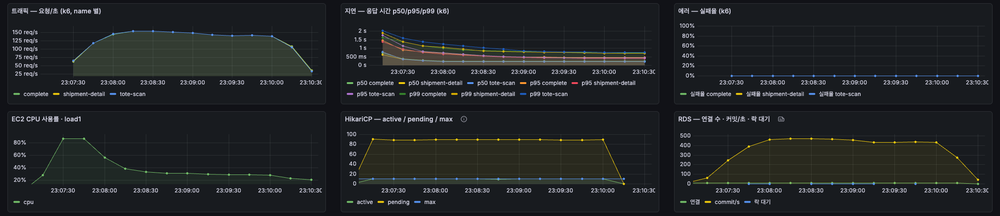
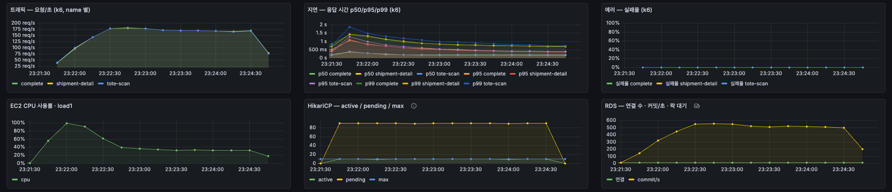
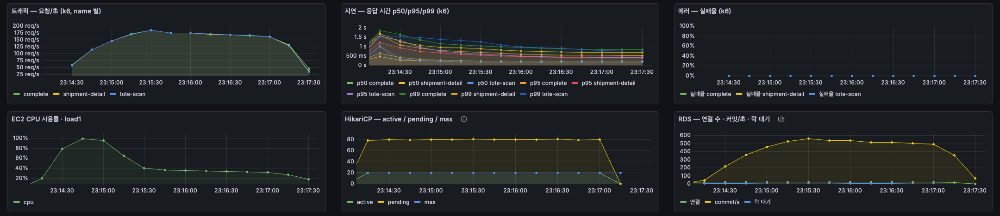
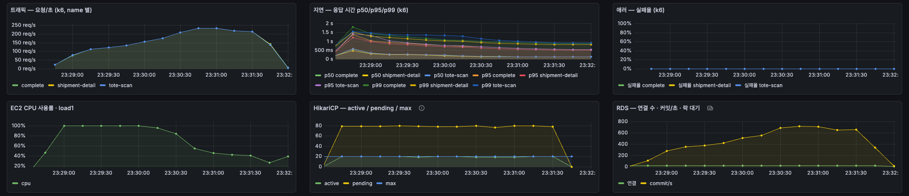

# 포장 완료 트랜잭션 단축 전·후 (2026-09-28 23:03~23:46 KST)

포장 완료가 박스 재고 행 락을 쥔 채 DB 를 여러 번 오가던 것을, 박스 재고 차감을 트랜잭션 마지막 UPDATE 한 문장으로 옮겨 락 보유 시간을 줄였다. 같은 수정으로 박스 재고 갱신 손실도 없어졌다. 조건별 원본은 `sat/`(k6 요약, 대기 이벤트 1초 표본, 박스 재고 확인), 시각별 경과는 `progress.md`.

## 수정

backend 브랜치 `fix/packing-complete-short-tx` b8d1f10(main 093978f 기준, 병합 전).

| 항목 | 이전 | 이후 |
| --- | --- | --- |
| 박스 재고 차감 | 상품 원장 기록 뒤 `SELECT ... FOR UPDATE` 로 잠그고, 토트 조회·할당 해제·완료 건수 집계·플러시를 거쳐 커밋 | 다른 단계를 모두 끝낸 뒤 `stock_qty = stock_qty - 1 WHERE id = ? AND stock_qty > 0` 한 문장, 곧바로 커밋 |
| 품목·상품 조회 | 품목 2회(무게 검수·원장 기록), 상품은 품목마다 id·바코드·바코드로 3회 | 품목 1회, 상품 1회(`findAllById`) |
| 완료 건수 집계 | 트랜잭션 안 | 트랜잭션 안(밖으로 빼면 커넥션을 한 번 더 받아야 해 풀이 찬 상황에서 대기가 한 번 더 생긴다) |

박스 재고 갱신 손실 원인: 무게 검수가 박스 무게를 읽으려고 박스 엔티티를 잠금 없이 먼저 불러온다. 뒤의 잠금 조회는 SELECT FOR UPDATE 를 보내지만 영속성 컨텍스트에 있던 옛 인스턴스를 그대로 돌려주고, 그 값에서 1을 빼 저장한다. 동시에 끝난 완료끼리 서로의 차감을 덮어쓴다. 무게 검수가 들어간 2404001(09-14)부터 있던 결함이다. `ShipmentCompleteDeadlockIT` 에 박스 재고 차감 = 완료 수 검증을 추가했다(이전 코드 40 완료에 20 차감, 이후 통과). 전체 테스트 265개 통과. `MeasurementImageUploadBeforeResponseIT` 는 이 변경과 무관하게 멈춰(업로드 풀 거부 경로의 래치 대기) 제외하고 돌렸다.

## 환경·데이터

- 백엔드 EC2 c7i-flex.large(2 vCPU), RDS db.t4g.micro, 부하 발생기 같은 VPC. 커넥션 획득 타임아웃 30초, Tomcat 200.
- 이미지: 이전 = main 093978f 를 EC2 에서 빌드한 `cj-ai-backend:short-tx-before`, 이후 = b8d1f10 `cj-ai-backend:short-tx`. 두 이미지 차이는 이 수정뿐이다.
- 주문: 접두사 `DS-` 20,000건(실행 6 의 8,000건에 같은 시드로 12,000건 추가), 상품 1,706종 균등, 배송단위 33,974건. 토트가 모자라 `DST-` 토트 20,000개를 넣었다(`tools/loadtest/sweep/ds-totes.sql`).
- 부하: 작업자 100명이 쉬지 않고 스캔 → 상세 조회 → 포장 완료(`sat:100:0:0:0`). 워밍업 30초 + 판독 150초. 조건마다 원장(컷오프 3337894)·배송단위·박스 재고(50,000)를 원복하고 90초 기다렸다.
- 순서: 이전 p10 → 이전 p20 → 이후 p10 → 이후 p20 → 이후 p10 → 이전 p10(풀 10 은 ABBA).

## 결과

| 풀 | 이미지 | 회 | 완료/s | 커넥션 점유 p95 | 커넥션 획득 p95 | 완료 서버 p95 | 행 락 대기(평균 세션) | 실패 | 박스 재고 차감 / 포장 |
| ---: | --- | ---: | ---: | ---: | ---: | ---: | ---: | ---: | ---: |
| 10 | 이전 | 1 | 145.6 | 54.0ms | 341ms | 379ms | 1.16 | 0 | 12,135 / 24,772 |
| 10 | 이전 | 2 | 140.9 | 55.6ms | 350ms | 389ms | 1.23 | 0 | 11,697 / 23,898 |
| 10 | 이후 | 1 | 170.5 | 30.3ms | 294ms | 331ms | 0.08 | 0 | 28,488 / 28,488 |
| 10 | 이후 | 2 | 168.8 | 30.8ms | 303ms | 340ms | 0.03 | 0 | 28,073 / 28,073 |
| 20 | 이전 | 1 | 167.0 | 139.0ms | 306ms | 447ms | 7.94 | 0 | 8,740 / 27,938 |
| 20 | 이후 | 1 | 189.4 | 64.8ms | 418ms | 481ms | 0.24 | 0 | 31,073 / 31,073 |

행 락 대기 = `pg_stat_activity` 1초 표본의 `Lock:tuple` + `Lock:transactionid` 평균 세션 수. 박스 재고 차감·포장은 워밍업을 포함한 조건 전체 값.

판독:

- **풀 10**: 완료/s 143.3 → 169.7(두 회 평균, +18%). 커넥션 점유 p95 54.8 → 30.6ms(−44%). 행 락 대기 1.2 → 0.1 세션. 회차 사이 차이는 이전 3%, 이후 1% 로 전·후 차이보다 작다.
- **풀 20**: 이전에는 늘린 커넥션 10개 중 약 8개가 박스 행 락을 기다렸다(행 락 대기 7.9 세션, 점유 p95 139ms). 이후에는 0.2 세션이고 완료/s 167.0 → 189.4(+13%). 커넥션을 늘렸을 때 줄 서는 곳이 박스 행 락으로 옮겨 가던 현상이 없어졌다.
- **박스 재고**: 이전에는 포장 수의 31~49% 만 차감됐다(51~69% 손실, 풀이 클수록 동시 완료가 많아 손실이 크다). 이후 여섯 조건 모두 차감 = 포장.
- 완료 서버 p95 는 풀 10 에서 12% 줄었다. 작업자 100명이 커넥션 10개를 두고 쉬지 않고 누르는 닫힌 부하라, 처리가 빨라진 만큼 다음 요청이 곧바로 들어와 커넥션 대기 줄(pending 91)은 그대로다. 응답 시간 대부분은 여전히 커넥션 획득 대기다.
- 이후 풀 20 은 EC2 CPU 평균 73% 이고 DB 세션 대부분(16.5)이 트랜잭션 중 앱 대기다. 다음 병목은 앱 서버 CPU 쪽이다.

## 한계

- 판독 초반에 EC2 CPU 가 100% 인 구간(JIT 컴파일로 추정, 미확인)이 있고, 이후 이미지에서 더 길었다(p20 이전 약 40초, 이후 약 90초). 워밍업 30초로는 다 빠지지 않아 이후 이미지 쪽이 불리하게 재졌다.
- 풀 20 은 조건마다 1회.
- 작업자 100명이 쉬지 않는 부하는 포화 확인용이다. 실제 피크(09-25 풀 실험 PLAN 1-2 의 작업자 100명 × 1분 1건)에서는 커넥션 대기가 없다.

## DB 에 남긴 것

`DS-` 주문 20,000건·배송단위 33,974건(마지막 조건 뒤 PACKED 23,898건), `DST-` 토트 20,000개, 원장 포장 행. 백엔드는 도구가 실험 전 이미지(cd6222eefbf2, `cj-ai-backend:latest`)로 복원했다. EC2 에 이미지 `short-tx-before`·`short-tx` 와 소스 `~/short-tx-before-src`·`~/short-tx-src` 를 남겼다. 시연 리셋은 부르지 않았다.
