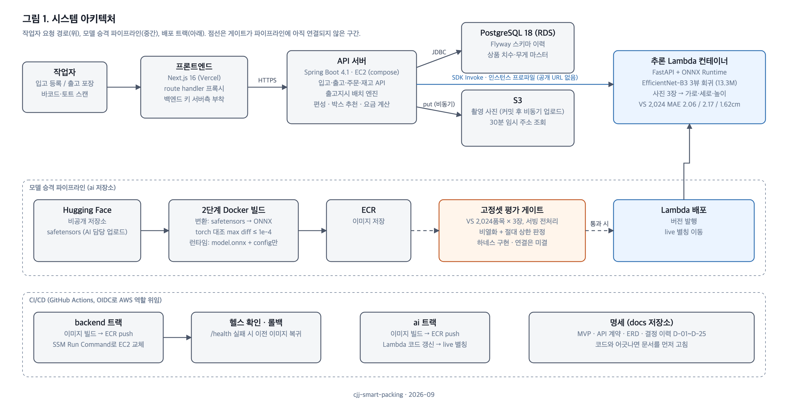
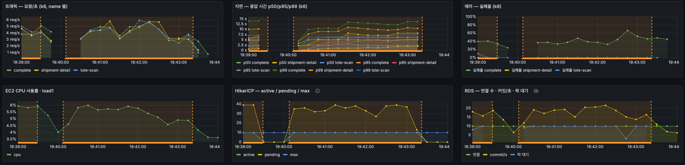
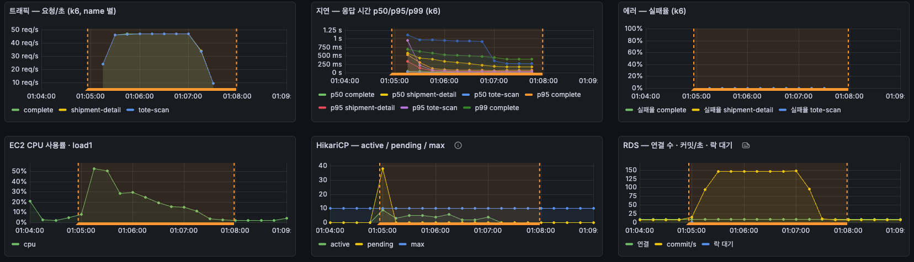
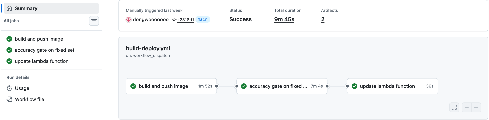

# VisionAI 기반 물류 스마트 패킹 — Docs 삽입용

(Docs에 붙일 때 이 줄과 제목은 뺍니다.)

---

## 시스템 아키텍처

**아키텍처 설계 이유**

- 추론 모델은 이미지 빌드 안에서 ONNX로 변환하고 PyTorch 출력과 대조한 뒤 ECR로 올려, 변환·검증·실행 환경을 하나로 맞췄습니다(성과 2).
- 치수 추론은 GPU가 더 빠르지만, ONNX 변환 후 CPU 추론 185ms로 요구사항(1초)을 만족하고 비용이 적어 Lambda 컨테이너에서 실행합니다. GPU 상시 가동은 월 약 380달러, 입고가 없는 시간에도 나갑니다(성과 2).
- Lambda는 공개 URL 없이 EC2의 IAM 역할로만 호출해 추론 경로를 API 서버 밖으로 열지 않았습니다.

---

## 성과 1. 재고 원장 전환으로 동시 포장 데드락 제거

### 문제 배경

- 포장 작업자 50명이 토트 스캔 → 상세 조회 → 포장 완료를 반복하는 부하(k6, 3분)에서 포장 완료 p95가 10초를 넘고 에러율이 40.4%였습니다. 락과 무관한 토트 스캔·상세 조회까지 p95 5~6초로 함께 느려졌습니다.
- EC2 CPU는 6%로 한가했습니다. CPU가 남는데 모든 API가 느려지면 공용 자원의 대기 문제라, 커넥션 풀과 DB를 봤습니다.
- 대기가 계층별로 쌓여 있었습니다. Tomcat 스레드 50개 전부 처리 중, HikariCP 커넥션 10개 전부 사용 중에 대기 39, DB에 들어간 세션 10개 전부 락 대기. 커넥션 점유 시간이 최대 14초라 풀이 마른 원인은 반납이 느린 것이었고, 풀을 늘려도 락 대기 줄만 길어지는 구조였습니다.
- 락 타임아웃이 없는데 에러가 나는 것은 DB가 트랜잭션을 끊고 있다는 뜻이라 데드락을 의심했습니다. 서버 로그의 `deadlock detected` 예외와 PostgreSQL 통계(`pg_stat_database.deadlocks`)에서 356건을 확인했고, 대기 대상은 전부 상품 재고 행이었습니다. 포장 완료가 박스에 담긴 상품의 재고 행을 하나씩 잠그는데, 잠그는 순서가 배송단위마다 달라 순환 대기가 생겼습니다.
- 잠금 전에 읽어 둔 수량으로 저장해 갱신 손실도 있었습니다. 재고 감소분이 포장 건수의 절반만 반영됐습니다.

### 해결 과정

| 해결 방안 | 장점 | 단점 |
| :-: | :-: | :-: |
| 원자적 갱신과 상품 ID 순 락 획득 | 데드락과 갱신 손실을 제거합니다. | 상품 수만큼 락은 남고, 변동 이력이 없습니다. |
| 낙관적 락 | 락 없이 버전 비교로 충돌을 감지합니다. | 동시 요청이 많을수록 재시도가 늘고, 변동 이력이 없습니다. |
| **재고 원장** | **수량을 고치지 않고 변동 행만 추가해 잠글 대상이 없습니다. 모든 변동이 한 곳에 남습니다.** | **현재 수량을 읽는 집계 구조가 필요합니다.** |

- 락 순서 통일은 상품 락 대기가 처리량 상한으로 남고, 재고 불일치를 추적할 이력이 없어 제외했습니다.
- 현재 수량은 5초마다 갱신하는 스냅샷에 미집계 원장 행을 더해 읽습니다. 커밋 순서가 어긋나 건너뛴 행은 60초마다 전체 대조로 잡습니다.

### 결론

재고 행을 갱신하지 않으므로 데드락과 갱신 손실이 구조적으로 발생하지 않습니다. 원장이 105만 행까지 쌓이자 집계 쿼리가 풀 스캔으로 3.39초 걸린 문제는 인덱스 범위 스캔으로 0.66ms로 줄였습니다.

같은 부하(포장 작업자 50명, 3분)에서 증상과 원인 지표가 함께 내려갔습니다.

| 지표 | 개선 전 | 개선 후 |
| :-: | :-: | :-: |
| 포장 완료 p95 | 10.07초 | 73ms |
| 에러율 | 40.4% | 0% |
| 처리량 | 초당 2.9건 | 초당 32.6건 |
| EC2 CPU (워밍업 뒤) | 6% (요청 초당 14) | 12% (요청 초당 139) |
| 커넥션 풀 대기 | 39 | 0 (시작 30초 제외) |
| RDS 락 대기 세션 | 10 | 2 |
| 데드락 | 356건 | 0건 |

데드락 제거, 재고 변동 이력 확보

---

## 성과 2. 치수 추론을 Lambda로 옮기고 정확도 게이트로 배포

### 문제 배경

- 팀 초기 설계는 GPU 인스턴스(g4dn.xlarge) 상시 가동이었습니다. 입고 시각이 불규칙해 대부분 유휴인데도 월 약 380달러가 나갔습니다.
- 모델을 바꿀 때 나아졌는지 판정할 기준이 없었습니다. 학습 리포트의 수치는 검증 분할과 전처리가 서비스와 달라 쓸 수 없었습니다.

### 해결 과정

| 해결 방안 | 장점 | 단점 |
| :-: | :-: | :-: |
| GPU 인스턴스 상시 가동 | 추론 시간이 가장 짧습니다. | 입고가 없는 시간에도 월 약 380달러가 나갑니다. |
| API 서버 안에서 CPU 추론 | 인프라가 단순합니다. | 2 vCPU에서 포장 요청과 CPU를 경합하고, Python 전처리를 Java로 다시 써야 합니다. |
| **Lambda 컨테이너(ONNX Runtime)** | **ONNX 변환으로 CPU 추론 1.07초를 185ms로 줄였습니다. 호출한 만큼만 과금되고 동시 촬영 수만큼 확장됩니다.** | **콜드스타트가 최대 9.5초입니다.** |

- 콜드스타트는 시연 시간대에만 Provisioned Concurrency로 실행 환경 1개를 미리 초기화해 막았습니다. 8시간에 하루 약 0.4달러입니다.
- 배포 여부는 GitHub Actions에서 고정 검증셋 2,024품목을 서비스 전처리 그대로 평가해 판정합니다. 축별 평균 절대 오차가 직전 모델보다 0.2cm 넘게 늘지 않고 3cm 이하이며, ±3cm 적중률이 2%p 넘게 떨어지지 않을 때만 Lambda 별칭을 옮깁니다.

### 결론

GPU 없이 CPU 추론 185ms로 서빙해 상시 가동 비용을 없앴습니다. 시연 기간 Lambda 핸들러 p95는 609ms로 목표 1초 안이었습니다(콜드스타트를 뺀 246건 기준).

속도만 보면 INT8 양자화 후보(164ms)가 가장 빨랐지만 ±3cm 적중률이 62.5%에서 22.6%로 떨어져 게이트에서 자동 차단됐습니다. 재학습 없이 통과하는 경량화 후보가 없어 양자화하지 않은 ONNX 모델을 배포했습니다.

GPU 상시 비용 제거, 배포 전 정확도 자동 판정
