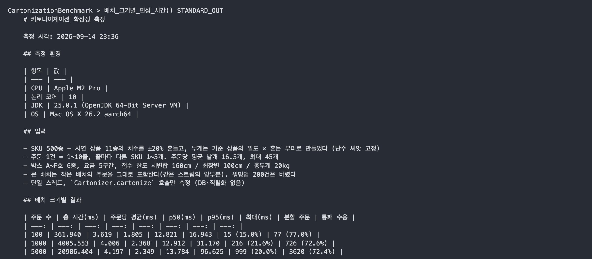

# VisionAI 기반 물류 스마트 패킹 — Docs 삽입용

(Docs에 붙일 때 이 줄과 제목은 뺍니다.)

---

## 시스템 아키텍처

**아키텍처 설계 이유**

- **모델 배포 검증**: 학습과 서비스의 출력이 달라지지 않도록, CI/CD에서 변환 전후 출력을 대조하고 이전 모델보다 정확도가 떨어지면 배포를 멈춥니다(문제 2).
- **추론 서버 대신 Lambda**: 추론은 입고 때만 호출되므로, 호출한 만큼만 과금되는 Lambda에서 실행합니다(문제 2).

---

## 문제 1. 치수와 무게를 함께 보는 박스 판정

### 문제 배경

- **박스 추천**: 포장 단계에서 주문 상품을 담을 박스와 개수를 정해 작업자에게 추천해야 했습니다. 작업자가 추천대로 바로 포장하려면, 추천한 박스에 상품이 들어가고 택배 접수 한도(무게 20kg, 세 변 합 160cm, 최장변 100cm)도 넘지 않아야 합니다.

### 해결 과정

- **부피·무게 합으로 비교**: 상품의 부피 합과 무게 합을 박스 부피, 무게 한도와 비교하는 방식은 구현이 단순합니다. 그러나 부피가 맞아도 상품이 들어가지 않는 박스를 추천합니다. 25×25×20cm 상품 두 개는 부피 합이 30×30×30cm 박스보다 작지만, 나란히 놓으면 한 변이 40cm가 되어 들어가지 않습니다.
- **배치와 무게를 함께 판정**: 그래서 상품을 박스 안에 하나씩 배치해 모든 상품이 놓이는지 확인하고, 택배 접수 한도를 넘지 않는지도 함께 검사합니다. 두 검사를 모두 통과한 박스만 추천합니다.
  - 배치 판정: 상품을 놓을 수 있는 위치와 방향을 모두 시험하면 상품 수가 늘수록 계산 시간이 급격히 늘어납니다. 그래서 상품을 하나씩 바닥 안쪽 자리부터 6방향으로 돌려 가며 확인하고, 들어가는 자리를 찾으면 위치를 확정한 뒤 다음 상품으로 넘어갑니다.
  - 여러 박스로 나누기: 치수나 무게 때문에 한 박스에 다 담을 수 없으면 주문을 여러 박스로 나눕니다. 상품을 부피가 큰 순서로 하나씩 배정하는데, 먼저 선택한 박스부터 차례로 확인해 함께 담을 수 있으면 넣고, 어느 박스에도 담을 수 없으면 박스를 추가합니다. 큰 상품을 먼저 배정하면 남은 공간을 작은 상품이 채워 박스 수가 줄어듭니다.

### 결론

| 항목 (다품목 주문 5,000건) | 치수만 판정 | 치수·무게 판정 |
| :-: | :-: | :-: |
| 20kg 넘는 박스가 나온 주문 | 689건 (13.8%) | **0건** |
| 박스 수 | 5,551개 | 6,036개 |

- **박스 수 증가**: 20kg을 넘던 박스(최대 45.7kg)를 나눠 담아 박스 수가 8.7% 늘었습니다.
- **계산 시간**: 주문 하나의 박스를 정하는 데 p95 13.8ms가 걸렸습니다(단일 스레드).

---

## 문제 2. 치수 추론 서빙과 모델 배포 판정

### 문제 배경

- 치수 추론 모델을 서빙할 인프라 구성이 필요했습니다.
- 추가 학습한 모델이 기존 모델보다 추론 정확도가 떨어지지 않는지 확인할 수 있어야 했습니다.

### 해결 과정

**서빙 인프라**

| 해결 방안 | 장점 | 단점 |
| :-: | :-: | :-: |
| GPU 인스턴스 상시 가동 | 추론 시간이 가장 짧습니다. | 치수 추론이 없는 시간에도 과금됩니다. |
| **Lambda 컨테이너 (채택)** | **호출한 만큼만 과금됩니다.** | **일정 시간 호출이 없으면 다음 호출에서 콜드스타트가 발생합니다.** |

- **Lambda 선택 이유**: 작업자가 화면에서 결과를 기다리므로 추론은 p95 1초 안에 끝나야 했습니다. ONNX로 변환한 모델은 Lambda(CPU) 웜 호출에서 p95 609ms로 이를 충족했습니다. 입고는 작업 시간대에만 진행되어 그 시간에만 실행 환경을 미리 띄워 두면 되므로, 상시 과금되는 GPU 인스턴스보다 비용이 적은 Lambda를 선택했습니다.

**배포 판정**

- **변환 대조**: ONNX 모델의 출력을 PyTorch 모델 출력과 비교해, 차이가 허용 오차를 넘으면 이미지 빌드를 멈춥니다.
- **정확도 평가**: 전처리가 다르면 같은 모델도 정확도가 달라지므로, GitHub Actions에서 고정 검증셋 2,024품목을 서비스와 같은 전처리로 평가합니다. 직전 모델보다 정확도가 떨어지면 서비스가 호출하는 Lambda 버전을 바꾸지 않습니다.

### 결론

- **INT8 차단**: 가장 빠른 INT8 양자화 모델(164ms)은 오차 3cm 안에 드는 품목 비율이 62.5%에서 22.6%로 떨어져 배포되지 않았습니다.
- **배포 모델**: 정확도 평가를 통과한 경량화 모델이 없어, 양자화하지 않은 ONNX 모델을 배포했습니다.
