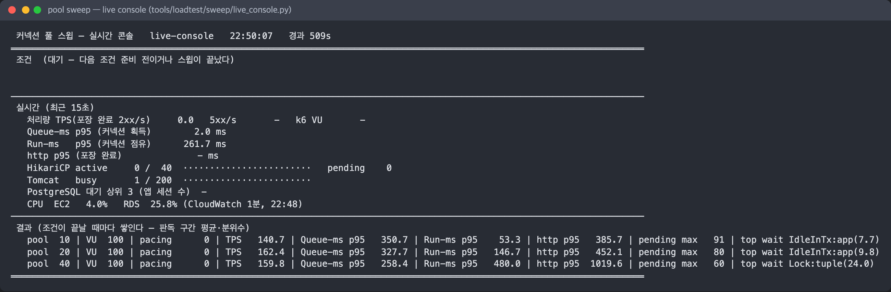
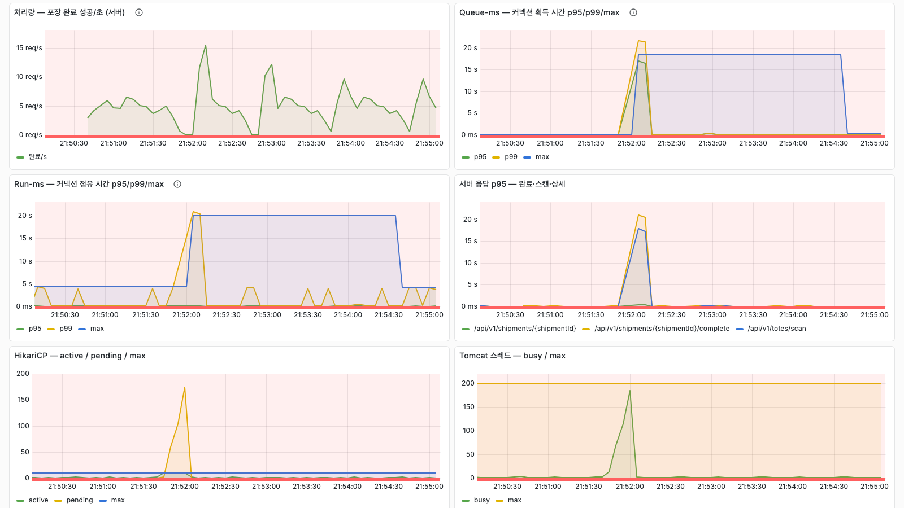
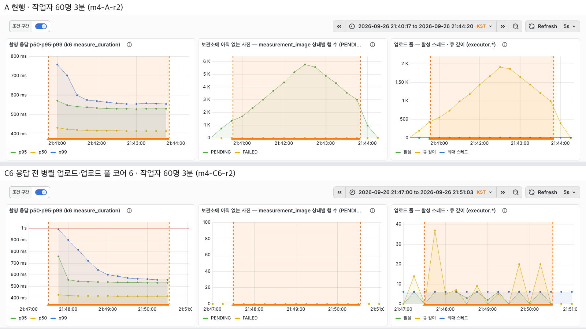
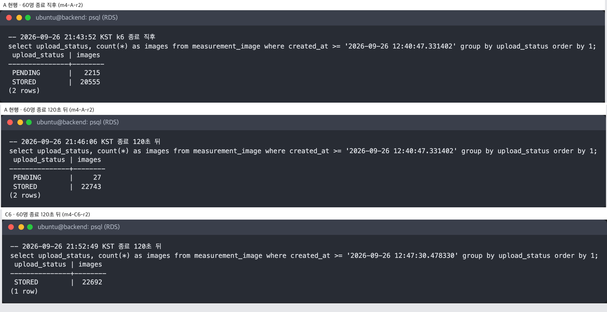

# PROJECT · VisionAI 기반 물류 스마트 패킹

**입고 검수 사진 3장으로 상품 치수를 측정하고, 출고 주문을 담을 박스를 추천하는 창고 시스템**

| | |
| --- | --- |
| 기간 | 2026.08.11 ~ 2026.08.31 팀 3주(5인) / 2026.09 개인 고도화 2주 |
| 기술 스택 | Java 21, Spring Boot, PostgreSQL(RDS), Flyway, AWS Lambda·EC2·S3, ONNX Runtime, Terraform, GitHub Actions, Prometheus·Grafana, k6 |
| 담당 역할 | 팀장. 백엔드·인프라·CI/CD 전담, 박스 편성 알고리즘, 추론 서빙을 GPU 서버에서 Lambda로 전환. 개인 기간에 부하 테스트와 아래 개선 전부 |
| GitHub | github.com/dongwooooooo/cjj-smart-packing |

**핵심 성과**

- 동시 포장 50명(현장 속도의 20배 이상) 부하에서 재고 갱신 데드락으로 **에러율 40.4%** → 재고 원장 전환 후 **0%**, 포장 완료 p95 **10초 이상(타임아웃) → 73ms**, 처리량 **11배**
- 촬영 사진 비동기 업로드가 부하에서 조용히 유실되던 문제를 "추론·업로드 병렬 후 응답"으로 재설계해 같은 조건에서 미저장 사진 **27장 → 0장**, 응답 p95 540ms 유지
- 배포 전 고정셋 2,024품목 정확도 게이트를 파이프라인에 넣어 가장 빠른 INT8 후보(164ms)를 적중률 **62.5% → 22.6%** 하락으로 **자동 차단**. ONNX 변환으로 CPU 추론 **1.07초 → 185ms**, GPU 없이 Lambda 서빙

**서비스 기능**

- 입고: 카메라 3대 촬영 → 치수 추론 → 작업자 확인·확정 → 상품 등록
- 주문: 배치 접수, 재고 판정, 토트(운반함) 배정
- 출고: 3D 빈 패킹으로 박스 편성·추천, 포장 완료 시 무게 검수
- 재고: 변동 원장 기반 수량 관리, 관리자 조정
- 운영: Grafana 대시보드, 모델 검증·배포 파이프라인

## 시스템 아키텍처

| 영역 | 구성 | 역할 |
| --- | --- | --- |
| 프론트엔드 | Next.js | 입고 촬영·치수 확정, 출고 포장, 대시보드 |
| API 서버 | Spring Boot, EC2 1대 | 입고·출고·주문·재고 처리, 박스 편성 |
| 저장소 | PostgreSQL(RDS), S3 | 업무 데이터, 촬영 사진 |
| 치수 추론 | AWS Lambda 컨테이너, ONNX Runtime | 사진 3장 → 가로·세로·높이 |
| 모델 파이프라인 | GitHub Actions | 모델 변환 → 고정셋 정확도 검증 → 통과 시 Lambda 배포 |
| 관측·부하 | Prometheus, Grafana, k6 | 지표 수집, 부하 발생 |

**아키텍처 설계 이유**

1. 치수 추론은 Lambda(CPU): 입고 시각이 불규칙해 GPU 상시 가동의 유휴 비용을 피하고, ONNX 변환으로 CPU 추론이 185ms라 충분했습니다.
2. 재고는 수량 갱신 대신 변동 원장: 동시 포장의 상품 락 데드락과 갱신 손실을 없애기 위해서입니다(Problem 1).
3. 사진 업로드는 추론과 병렬, 둘 다 끝나야 응답: 응답이 곧 "사진 저장 완료"라 유실이 없습니다(Problem 3).
4. 모델은 정확도 게이트 통과분만 배포: 속도만 보고 정확도가 떨어진 모델이 나가는 일을 막습니다(Problem 4).
5. API 서버 1대: 가정한 포장 피크(작업자 300명, 초당 포장 5건)를 1대가 대기 없이 처리해 이중화는 미뤘습니다.

---

# 스트레스 테스트 및 성능 최적화

## 서버에 대한 스트레스 테스트 진행

**테스트 이유** — 시연은 작업자 1명이었습니다. 창고 규모의 동시 작업에서 어디서 먼저 병목이 생기는지 찾기 위해 수행했습니다.

**테스트 도구** — k6, Prometheus·Grafana(응답 시간, 커넥션 풀, Tomcat 스레드, DB 대기 이벤트). API 서버 EC2 2 vCPU, RDS 2 vCPU·1GB.

**테스트 내용** — 시나리오는 작업자 행동 단위입니다. 촬영은 "촬영 → 결과 확인", 포장은 "토트 스캔 → 주문 확인 → 포장 완료". 작업자 1명이 1건을 끝내고 1초 뒤 다음 건을 시작해, 현장 속도(작업자당 분당 1~2건)의 20~40배 부하입니다.

| 테스트 | 조건 | 결과 |
| --- | --- | --- |
| 촬영 API | 입고 작업자 1→100명, 9분 | 응답은 전부 정상. 그런데 S3에 올라가지 않은 사진 **1,155장** |
| 동시 포장 | 포장 작업자 10명 → 50명, 3분 | 10명에서 에러 12.1%, 50명에서 **40.4%**. 포장 완료 p95 **10초 이상**(프론트 타임아웃), 데드락 356건, 재고 감소분이 포장 건수의 절반만 반영 |
| 주문 일괄 접수 | 5,000건 배치 2개 겹침 | 배치 1건이 272초, 겹친 배치가 같은 토트를 골라 한쪽 전체 롤백 |

**테스트 결과** — 포장 완료가 박스에 담긴 상품마다 락을 잡는데 박스마다 잠그는 순서가 달라 데드락이 났고, 락 대기가 커넥션 풀(10개)을 점유해 락과 무관한 조회까지 최대 10.5초 기다렸습니다. 촬영은 응답만 보면 정상인데 업로드 큐가 차면서 사진이 에러 없이 버려졌습니다. CPU·메모리는 어느 쪽도 차지 않았습니다.

**개선점**

- 재고 수량 갱신을 없애고 변동을 원장에 추가하는 구조로 바꿔 상품 락과 데드락을 제거했습니다(Problem 1).
- 커넥션 풀 크기와 타임아웃을 공식 대신 실측으로 정했습니다. 풀 10 유지, 타임아웃 30초 → 3초(Problem 2).
- 사진 업로드를 추론과 병렬로 실행하고 둘 다 끝나야 응답하도록 바꿔 유실을 없앴습니다(Problem 3).
- 원장이 105만 행까지 쌓이면 집계 쿼리가 상품마다 원장을 풀 스캔하는 문제를 찾아 인덱스 범위 스캔으로 고쳤습니다. 쿼리 **3.39초 → 0.66ms**.
- 업로드 스레드 풀이 큐가 차기 전에는 스레드를 늘리지 않는 동작을 확인하고 기본 스레드를 3 → 6으로 올렸습니다.

## 개선 후 서버에 대한 스트레스 테스트 진행

**테스트 결과** — 같은 조건으로 재측정했습니다.

| 지표 | 개선 전 | 개선 후 |
| --- | --- | --- |
| 포장 50명 에러율 | **40.4%** | **0%** |
| 포장 완료 p95 | **10초 이상**(타임아웃) | **73ms** |
| 포장 처리량(완료/초) | 2.9 | 32.6(넣은 부하를 대기 없이 처리) |
| 데드락 | 356건 | 0건 |
| 촬영 60명 미저장 사진 | 부하 중 최대 5,700장, 종료 후 **27장** 잔존 | **0장** |
| 촬영 응답 p95(60명) | 540ms | 540ms |

- 에러율 **40.4% → 0%**, 처리량 **11배**, 포장 완료 p95 **138배 단축**
- 촬영 사진 유실 **0장**, 응답 시간은 그대로

---

# Problem

## 1. 동시 포장 시 재고 갱신 데드락 → 재고 원장(append-only ledger)

**문제 배경** — 포장 완료가 박스에 담긴 상품 행을 하나씩 잠그고 수량을 줄이는데, 박스마다 잠그는 순서가 달라 데드락이 났습니다. 락은 잡았지만 갱신에 쓴 값이 락 이전에 읽어 둔 값이라 갱신 손실도 함께 생겼습니다.

**해결 과정**

| 해결 방안 | 설명 | 장점 | 단점 |
| --- | --- | --- | --- |
| 원자적 갱신 + 락 순서 통일 | 단일 UPDATE, 상품 ID 순 잠금 | 데드락·갱신 손실 제거 | 상품 수만큼 락은 그대로, 변동 이력 없음 |
| 낙관적 락 | 버전 비교로 충돌 감지 후 재시도 | 락 없음 | 동시 요청이 많을수록 재시도 증가, 이력 없음 |
| **재고 원장** | 수량을 고치지 않고 "−1" 변동 행을 추가 | 잠글 대상 자체가 없음. 모든 변동이 한 곳에 남아 불일치 추적 가능 | 현재 수량을 읽는 집계 구조 필요 |

채택안의 현재 수량은 스냅샷에 아직 집계되지 않은 원장 행을 더해 읽습니다. 스냅샷은 5초마다 갱신하되 기록된 지 60초 지난 행만 집계합니다. 원장 ID 순서와 커밋 순서가 어긋나 건너뛴 행은 60초마다 도는 전체 대조가 잡으므로, 조회값이 틀릴 수 있는 창은 최대 60초입니다. 재고 부족 판정은 접수 단계에서만 하고, 포장대에 온 상품은 이미 꺼낸 실물이라 포장 완료에서는 판정하지 않습니다.

**결론** — 잠글 대상이 사라져 데드락과 갱신 손실이 구조적으로 불가능해졌습니다. 같은 부하에서 에러율 **40.4% → 0%**, p95 **10초 이상 → 73ms**. 남은 락은 박스 자재 재고 1행뿐이고, 이것이 포화 처리량의 상한입니다(더 개선할 부분 1).

## 2. 커넥션 풀 크기와 타임아웃을 실측으로 결정

**문제 배경** — 풀은 기본값(10개, 타임아웃 30초)이었고 이 규모에 맞는지 잰 적이 없었습니다. 타임아웃 30초는 프론트엔드 타임아웃(10초)이 지난 요청도 서버에서 20초 더 기다리게 합니다.

**해결 과정**

| 해결 방안 | 설명 | 장점 | 단점 |
| --- | --- | --- | --- |
| HikariCP 권장 공식 | 코어 × 2 + 스핀들 = 4 | 계산 간단 | 커넥션 점유 = DB 실행 시간이 전제. 실측은 점유 시간의 74%가 트랜잭션 안 애플리케이션 구간 |
| 리틀의 법칙 | 초당 요청 5 × 점유 22ms = 0.11개. 피크 3배에서 5개 이상 겹칠 확률 0.002% → 4 + 배치 1 + 스케줄러 1 = 6 | 부하 기반 | 평균이라 포화·락 대기를 반영 못 함 |
| **부하 고정 후 풀 크기·타임아웃만 바꿔 실측** | 판정 규칙과 예측을 실험 전에 기록. 현장 부하(100·300명), 포화(100명·대기 0), 락 20초 주입 3종 | 실제 병목 위치가 드러남 | 조건당 3분, 20회 이상 |

실험은 직접 만든 스윕 스크립트와 실시간 콘솔로 돌렸습니다. 조건마다 원장을 되돌리고 k6 → Prometheus → 판정을 자동으로 진행합니다.

**부하테스트 결과** (포화 부하, 작업자 100명)

| 풀 크기 | 처리량(완료/초) | 포장 완료 p95 | DB 락 대기 비중 |
| --- | --- | --- | --- |
| 5 | 78 | 577ms | 8% |
| **10** | 125 | **445ms** | 19% |
| 20 | 137 | 571ms | 47% |
| 30 | 138 | 882ms | 63% |
| 40 | 132 | 1.3초 | 72% |

현장 부하(100·300명)에서는 풀 5~40 모두 처리량이 같고 커넥션 대기가 없었습니다. 락 20초 주입 실험에서 타임아웃 30초는 락과 무관한 조회 절반이 6~7초, 일부는 10초 프론트 타임아웃까지 걸렸고 Tomcat 스레드 200개가 소진됐습니다. 3초는 3초에 에러로 끝나 화면 멈춤이 없었습니다.

**결론** — 풀 **10 유지**, 타임아웃 **30초 → 3초**. 풀 20은 처리량이 10% 높지만 락 대기 비중이 47%로 커지고 p95도 길어졌습니다. 풀을 늘려도 박스 자재 락 대기열만 길어지므로 상한은 풀이 아니라 락입니다. 3초는 포화 재검증에서 커넥션 대기 최대 2.6초를 넘는 값이고, 처리량은 기본값과 1% 차이였습니다.

## 3. 촬영 사진 업로드 유실 → 추론·업로드 병렬 후 응답

**문제 배경** — 사진 업로드를 커밋 뒤 비동기로 넘겼는데, 45명부터 업로드 큐(작업 2,000건, 작업 1건 = 사진 3장)가 차면서 작업이 에러 없이 버려졌습니다. 작업자 화면은 성공인데 사진은 영구히 없는 상태였습니다.

**해결 과정**

| 해결 방안 | 설명 | 장점 | 단점 |
| --- | --- | --- | --- |
| 유실분 재업로드 스케줄러 | 미저장 행을 주기적으로 다시 올림 | 구현 단순 | 응답 시점에 사진이 없는 상태는 그대로 |
| 클라이언트 presigned URL 업로드 | 프론트가 S3에 직접 올림 | 서버 부하 없음 | 추론용 사진을 서버가 따로 받아야 해 경로가 둘 |
| 메시지 큐 + 워커 | 업로드를 브로커로 분리 | 유실 방지 | 브로커 운영 추가 |
| **추론·업로드 병렬 실행 후 응답** | 사진 3장 업로드(37ms)를 추론 왕복(API 서버 기준 p50 320ms) 안에 끝내고 둘 다 성공해야 응답 | 응답 = 저장 완료, 추가 인프라 없음 | 업로드 실패가 곧 응답 실패(작업자 재촬영) |

스레드 풀이 차면 거절하지 않고 요청 스레드가 직접 올립니다. 큐가 차도 사진은 빠지지 않고 응답만 느려지며, 8초를 넘으면 에러로 끝냅니다. S3 SDK에는 시도 2초·호출 6초 상한을 두었습니다.

**부하테스트 결과** (작업자 60명, 3분, 시연 환경)

| 지표 | 커밋 뒤 비동기 업로드 | 병렬 업로드 후 응답 |
| --- | --- | --- |
| 미저장 사진 | 부하 중 큐 대기 최대 **5,700장**, 거절 9건으로 종료 후 **27장** 잔존 | **0장** |
| 촬영 응답 p95 | 540ms | 540ms(업로드 스레드 6개) |
| 단일 요청 p95 | 467ms | 482ms |

**결론** — 유실을 나중에 복구하는 대신 애초에 생기지 않게 했습니다. 미저장 **27장 → 0장**, 응답 p95는 **540ms로 동일**. 업로드 스레드 3개에서는 p95가 946ms까지 올랐습니다. 큐가 차기 전에는 스레드를 늘리지 않는 풀 동작 때문이라 기본 스레드를 6개로 올렸습니다.

## 4. 치수 추론 서빙을 Lambda로, 정확도 게이트로 배포

**문제 배경** — 팀 초기 설계는 GPU 서버 상시 가동(g4dn.xlarge, 월 약 380달러)이었습니다. 운영 입고는 시각이 불규칙해 유휴 비용을 계속 냅니다. 모델을 바꿀 때 나아졌는지 판정할 기준도 없었습니다. 학습 리포트의 수치는 검증 분할과 전처리가 서비스와 달라 그대로 쓸 수 없었습니다.

**해결 과정**

| 해결 방안 | 설명 | 장점 | 단점 |
| --- | --- | --- | --- |
| GPU 인스턴스 상시 가동 | g4dn.xlarge 24시간 | 추론 최단 | 월 약 380달러, 유휴 비용 |
| API 서버 안에서 CPU 추론 | Spring 서버에 모델 탑재 | 인프라 단순 | 2 vCPU에서 포장 요청과 CPU 경합, Python 전처리 재작성 |
| **Lambda 컨테이너(ONNX Runtime)** | PyTorch 모델을 ONNX로 변환해 실행, 호출한 만큼 과금 | CPU 추론 1.07초에서 185ms로 단축, 동시 촬영만큼 확장 | 콜드스타트 최대 9.5초 |

콜드스타트는 시연 시간대만 실행 환경 1개를 미리 띄워(Provisioned Concurrency) 막았습니다. 배포는 GitHub Actions에서 고정 검증셋 2,024품목으로 서비스 전처리 그대로 평가하고, 직전 모델 대비 MAE +0.2cm·±3cm 적중률 −2%p 안(절대 상한 MAE 3cm)일 때만 Lambda 별칭을 옮깁니다.

**결과**

| 지표 | 개선 전 | 개선 후 |
| --- | --- | --- |
| CPU 추론 시간(모델 실행) | 1.07초(PyTorch) | **185ms**(ONNX Runtime) |
| 월 비용 | GPU 상시 약 380달러 | 24시간 예약 약 36달러 + 호출 종량(시연 319건 1센트) |
| 시연 기간 핸들러 p95 | — | 609ms(246건, 목표 1초) |
| 배포 판정 | 기준 없음 | INT8 후보(164ms) 적중률 **62.5% → 22.6%**로 **자동 차단** |

**결론** — 속도만 보면 INT8이 가장 빨랐지만 게이트가 막았습니다. 재학습 없이 통과하는 경량화 후보는 없었고 기준 모델을 배포했습니다.

## 5. 박스 편성을 부피 비교에서 3D 빈 패킹으로

**문제 배경** — 초기 판정은 "상품 부피 합 < 박스 부피"였습니다. 30×30×30cm 박스에 25×25×20cm 상품 2개는 부피로는 통과하지만 어떤 방향으로도 함께 들어가지 않습니다. 발표 심사에서 현업 심사위원이 지적하기 전까지 무게도 계산에 없었습니다.

**접근법** — 극점(extreme point) 배치로 상품을 실제로 넣어 보는 3D 빈 패킹 휴리스틱에 국소 탐색을 더했습니다. 목적 함수는 총 배송비(CJ대한통운 표준운임 5구간)라 요금표가 바뀌어도 편성이 따라갑니다. 포장 완료 때 실측 무게가 예상과 3% 넘게 다르면 완료를 막습니다.

**결과** — 합성 주문 5,000건(SKU 500종, 주문당 평균 16.5개) 벤치마크에서 주문당 **p50 2.3ms, p95 13.8ms**. 주문 접수 시점에 실시간 편성이 가능한 속도입니다.

---

# 더 개선할 부분

1. **박스 자재 락**: 포화 처리량의 상한입니다. 상품처럼 원장으로 옮겨 완료 시점 판정과 락을 없애면 풀 20에서 처리량이 더 오를지 확인합니다.
2. **주문 일괄 접수**: 접수마다 유휴 토트 3만 건을 읽어 5,000건 배치가 272초 걸리고, 겹친 배치가 같은 토트를 골라 전체 롤백됩니다. 잠긴 행을 건너뛰고 1건만 가져오는 방식과 500건 단위 저장으로 바꿉니다.
3. **API 서버 이중화**: 지금은 1대가 죽으면 입고·출고가 함께 멈춥니다. 집계 스케줄러 분산 락과 로드밸런서가 필요합니다.
4. **24시간 콜드스타트**: 상시 예약(월 약 36달러)과 주기 웜업 호출을 비용·첫 응답 지연으로 비교해 정합니다.
5. **박스 편성 효과 측정**: 부피 방식 대비 추천 변경 비율과 배송비 차이, 소형 주문의 전수 탐색 대비 품질을 측정합니다.
